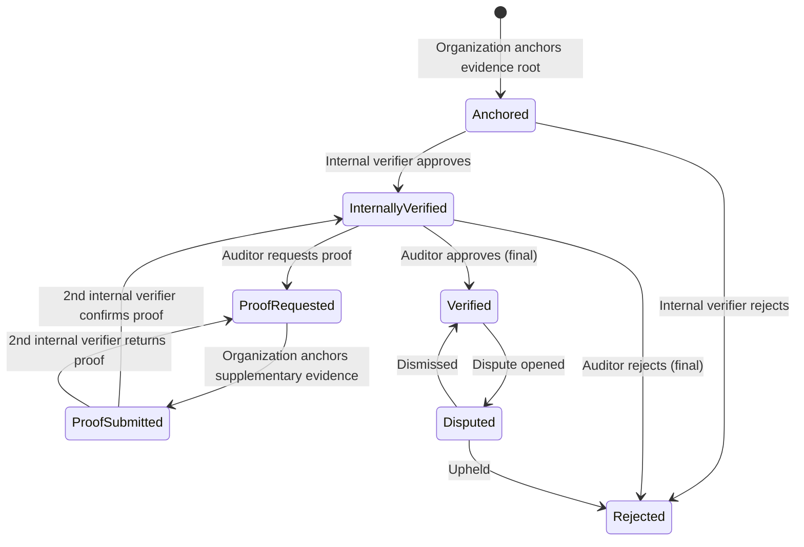
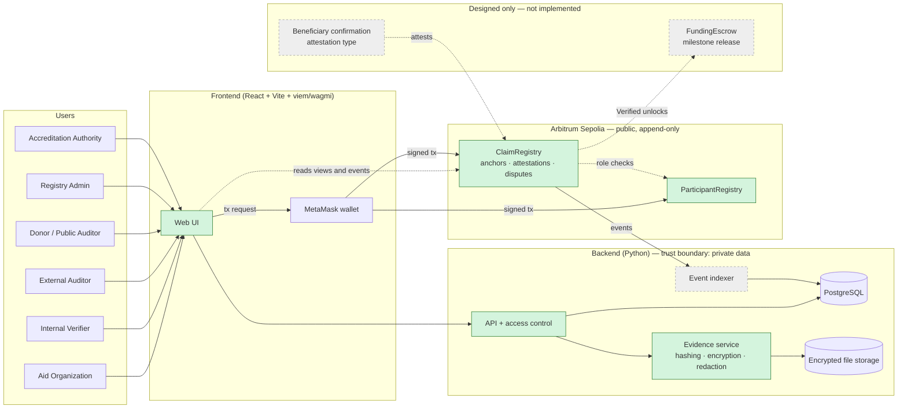

# Architecture

Describe the complete Proof of Aid system, including parts beyond the prototype.
Keep implementation status in [SUBMISSION.md](SUBMISSION.md).

> **Status:** Design as built (2026-09-24): contracts deployed to Arbitrum Sepolia, evidence backend and public verification page implemented. Implementation status per capability lives in [SUBMISSION.md](SUBMISSION.md#implementation-boundary).
> Requirements and acceptance criteria live in [`dbv-specs-ops/docs/SPECIFICATIONS.md`](../dbv-specs-ops/docs/SPECIFICATIONS.md).

## Vision and actors

**Goal:** someone who does not trust the aid organization can independently verify that an aid claim is backed by
evidence that (a) has not been altered since it was submitted and (b) was confirmed by the organization's internal
verifier and finally approved by an officially accredited external auditor, **without** that person ever seeing beneficiaries' personal data.

**Design principles**

1. **Verify, don't trust:** every trust-relevant state change is signed by a wallet and recorded onchain; everything else stays offchain.
2. **No personal data onchain:** only hashes/commitments that cannot be reversed into personal data are published.
3. **Two-stage verification:** a claim is only "Verified" after an internal verifier of the organization confirms it (first checkpoint) **and** an external, officially accredited auditor gives the final confirmation.
4. **Append-only history:** corrections, rejections and disputes are new events; nothing is overwritten.
5. **Wallet ≠ identity:** a wallet proves key control; accreditation links a wallet to a real-world organization.

**Actors**

| Actor | Role |
| --- | --- |
| **Registry Admin** | Registers organizations and their internal verifier accounts (maps wallets to real-world entities). A platform or consortium operator role. |
| **Accreditation Authority** | Official body that approves external auditors onchain, assigns one auditor to each internally verified claim, and resolves disputes. Deliberately a separate role from the Registry Admin (e.g. a public audit oversight body), so no single party both registers organizations and chooses their auditors. |
| **Aid Organization** | Registers needs and aid claims, uploads evidence, anchors evidence hashes onchain, answers auditors' proof requests. |
| **Internal Verifier** | Verified account belonging to the organization. First checkpoint: promptly confirms (or rejects) that the aid was provided correctly. When the auditor requests proof, a **second** internal verifier (different from the one who approved at checkpoint 1) confirms the supplementary proof before it returns to the auditor. Always a different wallet from the one that submitted the claim (separation of duties), so each organization registers at least two internal verifiers. |
| **External Auditor** | Independent auditor approved by the Accreditation Authority and assigned to the claim by it. Can request additional proof from the organization and gives the final confirmation (or rejection). |
| **Beneficiary** | Receives aid. Personal data is protected; in the future (Delivery & Impact) can confirm or challenge receipt. |
| **Donor / Public Auditor** | Unauthenticated third party that inspects a claim's timeline and verifies evidence integrity and attestations. |

## Implementation focus

> Within our complete Proof of Aid design, we focus on **Trust, Evidence & Privacy**, addressing **how a third party can trust an aid claim whose evidence contains beneficiaries' personal data and therefore cannot be published** through **offchain encrypted evidence whose Merkle root is anchored onchain, a contract-enforced two-stage verification (internal verifier → independent, officially accredited auditor with proof requests), accredited disputes, and a public page that re-verifies evidence integrity without revealing personal data**.

How the design answers the area's questions:

| Question | Answer in this design |
| --- | --- |
| **Who verifies claims?** | An internal verifier of the organization (fast first checkpoint, never the submitter), then an external auditor accredited **and assigned** by an independent Accreditation Authority (final say). Supplementary proof is confirmed by a second internal verifier. |
| **How is evidence checked?** | Each file is fingerprinted after metadata stripping as a salted commitment SHA-256(salt ‖ bytes); the bundle's Merkle root is anchored onchain before review. Verifiers, auditors and the public recompute hashes and compare against the onchain root; any change after anchoring is a mismatch. |
| **How is it disputed?** | Any accredited participant other than the claim's own organization and approving auditor can dispute a `Verified` claim within 60 days, posting a bond and a counter-evidence hash; the Accreditation Authority resolves it; the whole history stays public and append-only. Deposits make fraud and frivolous disputes cost money (see *Incentives*). |
| **How is it kept private?** | Files stay offchain, encrypted at rest, decryptable only by the organization, its internal verifiers and the assigned auditor. EXIF/GPS is stripped. Nothing personal (not even hashes of names or IDs) goes onchain; the organization may publish individual non-personal files. |

The rest of the flow (Need, Funding, Delivery, Outcome) is designed below but **not implemented**.

## End-to-end flow

`Need → Verification → Funding → Delivery → Outcome → Transparent history`. Steps in **bold** are the prototype's focus (Trust, Evidence & Privacy).

1. **Accreditation** — Registry Admin registers organization wallets and their internal verifier wallets onchain (`ORGANIZATION`, `INTERNAL_VERIFIER` linked to an organization); the Accreditation Authority approves external auditor wallets (`AUDITOR`).
2. **Need / claim creation** — Organization creates a claim (e.g. "500 food kits delivered in district X") via the backend; descriptive metadata is stored in PostgreSQL.
3. **Evidence upload** — Organization uploads evidence files (photos, receipts, signed delivery lists). The backend stores them offchain, encrypted at rest, and computes a salted fingerprint per file: SHA-256(salt ‖ sanitized bytes) with a random 32-byte salt, sealed with the claim key.
4. **Evidence anchoring** — The organization's wallet signs a transaction that records onchain: claim ID, evidence bundle root (Merkle root of file hashes) and metadata hash (keccak256 of the claim's title, description, region, date and ID, see *Claim metadata check* below). A `ClaimAnchored` event is emitted.
5. **Internal verification (checkpoint 1)** — An internal verifier of the same organization reviews the evidence, checks it against the onchain root and signs an attestation (`approve` / `reject` + justification hash). On approval the claim becomes `InternallyVerified`.
6. **External audit (checkpoint 2)** — The Accreditation Authority assigns an accredited external auditor to the claim; only that auditor can act on it. The auditor reviews the private evidence (role-checked). If it is insufficient, the auditor opens an onchain **proof request** (hash of the request text) and the claim becomes `ProofRequested`. The organization anchors supplementary evidence (`ProofSubmitted`); a second internal verifier of the organization, different from the checkpoint-1 verifier, confirms it (back to audit) or sends it back (`ProofRequested`). The auditor then signs the final attestation: `approve` → `Verified`, `reject` → `Rejected`.
7. **Dispute** — Within 60 days of the approval, an accredited participant (not the claim's organization or its approving auditor) posts a dispute bond and a hash of counter-evidence; the claim becomes `Disputed` until resolved by the Accreditation Authority (`upheld` → `Rejected`, `dismissed` → `Verified`). After the window anyone can settle the claim, which releases the deposits; a settled claim can never be disputed.
8. *Funding (design only)* — Donations are escrowed and released per milestone once the related claim is `Verified`.
9. *Delivery & Impact (future)* — Beneficiary confirmation of receipt (e.g. signed acknowledgement or one-time code) is added as an additional attestation type.
10. **Public verification & history** — The public claim page reads status, evidence roots and the full event history **directly from `ClaimRegistry`** (no server in between), and lets anyone re-hash files in the browser against the onchain roots. Per-bundle file lists (manifests) come from the backend and are accepted only if their recomputed root matches the chain. An event indexer into PostgreSQL is an optional speed-up for search and dashboards, never the source of truth.

### Claim lifecycle (enforced onchain)

### Incentives: deposits, rewards and penalties (P9)

Fraud has to cost more than it pays, and a dispute must not be free. `ClaimRegistry` therefore holds
native ETH in escrow per claim. The two internal verifiers stay out of it: checkpoint 1 involves no
money. Payouts are pull-only: the contract credits an address and the owner calls `withdraw()`.

| Moment | Who pays in | Amount (reference / demo at 1/100) |
| --- | --- | --- |
| `anchorClaim` | Organization | penalty + auditor reward: 1.01 ETH / 0.0101 ETH |
| `attestFinal` approve | Auditor | auditor deposit: 0.1 ETH / 0.001 ETH (reject: nothing) |
| `openDispute` (only before `verifiedAt + 60 days`) | Disputant | dispute bond: 0.1 ETH / 0.001 ETH |

| Outcome | Organization gets | Auditor gets | Disputant gets |
| --- | --- | --- | --- |
| Rejected at checkpoint 1 or by the auditor | its whole deposit back | — (put nothing in) | — |
| Dispute dismissed (claim back to `Verified`) | half the bond (plus the odd wei) | half the bond | nothing (loses the bond) |
| Dispute upheld (claim `Rejected`) | nothing | nothing | bond + penalty + auditor deposit + reward |
| `settle` after the window, no open dispute (anyone may call) | its penalty back | its deposit + the reward | — |

Rationale and rules:

- The organization prepays the auditor's reward, so an honest approval is always paid. If the claim
  turns out fraudulent, that reward goes to the disputant rather than back to the organization: the
  organization committed the fraud, and the auditor who approved it loses its deposit too.
- The window starts once, at the approval (`verifiedAt`); a dismissed dispute does not restart it,
  so repeat disputes cost a bond each and end after 60 days. At most one dispute is open at a time,
  and one opened in time can be resolved after the window (settlement waits for it).
- The claim's organization and its approving auditor cannot dispute their own claim: an upheld
  self-dispute would pay the forfeited deposits back to the wrongdoers.
- Amounts are immutable constructor parameters. The testnet deployment uses 1/100 of the reference
  values (0.0001 / 0.001 / 0.01 / 0.001 ETH) and the real 60-day window.
- `withdraw` is the only function that sends ETH (checks-effects-interactions plus OpenZeppelin
  `ReentrancyGuard`); no function loops over claims.
- Known edge case, documented not fixed: a claim parked in `ProofRequested`/`ProofSubmitted` when its
  organization is revoked can never move on (P8.1), so its deposit stays locked.
- The Accreditation Authority remains the judge; replacing it with decentralized arbitration (Kleros)
  is the designed next step (see `SUBMISSION.md`).

## System diagram

Every state-changing action (accreditation, auditor assignment, anchoring, attestations, proof requests, disputes) is a transaction signed in the user's own MetaMask wallet; the contracts authorize it by the signer's role. The backend never holds user keys. The Donor / Public Auditor only reads and never signs.

Green components form the prototype's contribution (evidence anchoring, two-stage verification with proof requests, disputes, public verification). Grey dashed components are designed but not implemented; the public page does not depend on the indexer because it reads the contract directly.

## Components

| Component | Responsibility | Technology / approach | Why |
| --- | --- | --- | --- |
| `ParticipantRegistry` contract | Wallet roles (`ORGANIZATION`, `INTERNAL_VERIFIER` + organization link, `AUDITOR`); role admins (Registry Admin, Accreditation Authority) | Solidity + OpenZeppelin `AccessControl` | Standard, audited role management |
| `ClaimRegistry` contract | Claim anchors, evidence roots, two-stage attestations, proof requests, lifecycle state machine, disputes | Solidity, Foundry tests | The only state that must be independently verifiable |
| Backend API | Claims, evidence uploads per bundle, wallet-signature login, role-based access to private files, public claim view (private files as fingerprints only) and per-bundle manifests | Python — FastAPI + Pydantic v2, separate response models per viewer | Team language; validation at the boundary; a private field cannot leak through a shared model |
| Evidence service | Metadata stripping (EXIF/GPS) before hashing, salted SHA-256 commitment per file (salt encrypted with the claim key, per-claim HMAC for duplicate detection), one Merkle root per bundle (`root_index` 0 = original, n = supplementary proof), AES-GCM encryption at rest with a per-claim key | Python (`poa_shared` recipe) | Keeps personal data offchain and private; each bundle root equals `evidenceRoots(claimId)[n]` onchain |
| Evidence manifest | Per-bundle list of file fingerprints (`version` 1 or 2, `claimId`, `rootIndex`, `files[{sha256, public, name?, salt?}]`); names and salts only for public files, version 2 when the bundle holds salted files | JSON Schema in `code/shared/manifest.schema.json` | Lets anyone check a single file; untrusted by design because its recomputed root must match the chain |
| Event indexer *(designed, optional)* | Consumes contract events into queryable timelines; seals a bundle once its root is anchored; syncs participants from `ParticipantRegistry` | Python + web3.py RPC polling from the deployment block, idempotent per (tx hash, log index) | Fast search and dashboards; never the source of truth |
| Database | Operational data, indexed events, access logs | PostgreSQL | Mature, relational, suggested by organizers |
| File storage | Encrypted evidence files | Local Docker volume, files encrypted with a key from `.env` (MinIO/S3 is the production path) | Files do not belong onchain |
| Frontend | Public claim page (no wallet): status, verification summary and timeline read from the contract with `eth_getLogs` filtered by claim ID; in-browser verification of single files (via manifest) or whole bundles. Views per role for signing actions. | React + Vite + TypeScript + viem/wagmi + MetaMask | Ecosystem standard for EVM dapps; files never leave the visitor's browser |
| `FundingEscrow` contract *(designed only)* | Holds donations per claim milestone; releases funds only when the linked claim is `Verified` and not `Disputed` | Solidity, reads `ClaimRegistry` status | Makes verification economically meaningful |
| Beneficiary confirmation *(designed only, Delivery & Impact)* | Beneficiary acknowledges or challenges receipt through a one-time code redeemed by the backend into an attestation, without exposing their identity | Backend + new attestation type in `ClaimRegistry` | Closes the gap between delivery evidence and the recipient's own voice |

## Decisions and trade-offs

| Decision | Choice and rationale | Trade-off / alternative |
| --- | --- | --- |
| On/off-chain boundary | Onchain: accreditation, evidence roots, attestations, disputes, status. Offchain: files, descriptions, personal data. | Less transparency of content; gained privacy, cost and right-to-erasure compatibility. |
| Evidence integrity | Salted SHA-256 commitment per file (on sanitized bytes), Merkle root per bundle anchored onchain; tree built with the OpenZeppelin standard (keccak256, sorted pairs) and shared test vectors across Solidity, Python and TypeScript. | Single hash per file is simpler but costs one tx per file; Merkle root allows selective proof of one file. |
| Privacy of low-entropy data | Structured personal data (names, IDs) is never hashed raw; salted commitments only, salt kept offchain. | Salt loss makes the commitment unverifiable; raw hashes of names are brute-forceable. |
| Evidence confidentiality | Files private by default and encrypted at rest; the organization can mark individual non-personal files (receipts, invoices, aggregate reports) as public; only the owning organization, its internal verifiers and the auditor reviewing the claim can decrypt via backend; public sees hashes and attestations. | Public cannot inspect content themselves, so trust shifts to the auditor. Mitigated by the auditor's independent accreditation and public, attributable attestations. |
| Trust / verification | Two sequential stages enforced by the contract: internal verifier (fast first checkpoint, affiliated with the organization, not the submitter) then an external accredited auditor assigned by the Accreditation Authority (final, independent). Supplementary proof is confirmed by a second internal verifier before it returns to the auditor (four-eyes inside the organization). | The internal checks are not independent, so independence rests on the auditor; authority assignment stops the organization from choosing a friendly auditor, but a single auditor can still collude. Alternative: multiple auditors per claim. |
| Proof requests | The auditor's request, the organization's supplementary evidence and the second internal verifier's confirmation are anchored as hashes/attestations, so the back-and-forth is part of the public history. | More transactions per claim; the requests' content stays offchain (only its hash is public). |
| Identity & permissions | Allowlist of wallets: organizations and internal verifiers registered by the Registry Admin; auditors approved and assigned by a separate Accreditation Authority. One participant role per wallet, **for life**: a wallet that ever held a participant role can never be registered again in any role. | Trust in two central roles; splitting them prevents one party from both registering organizations and choosing their auditors. Permanent identity closes a real attack found while building (a verifier revoked, re-accredited as auditor and assigned the same claim would sign both checkpoints), at the cost that a revoked participant needs a new wallet. Future: verifiable credentials. |
| Salted evidence fingerprints (P8.2) | Every uploaded file, public or private, is committed as SHA-256(salt ‖ sanitized bytes) with a random 32-byte salt. The commitment is the leaf input (`leaf = keccak256(commitment)`), so the Merkle recipe, the shared vectors and the contracts are unchanged. The salt is stored encrypted with the claim key; public files publish it (claim view, manifest version 2) so anyone can re-hash them, private salts reach only the roles allowed to download the file. Everything is salted because a file can be made public after anchoring. Duplicates are detected with a per-claim HMAC-SHA256 of the sanitized bytes. **Claims recorded before P8.2 (including the Arbitrum Sepolia demo claim) keep unsalted SHA-256 fingerprints and version 1 manifests.** | Without a salt, anyone who can guess a private file (a standard form, a known photo) could hash it and confirm it is in a claim. Losing a salt makes that file unverifiable, and a private salted file can only be checked by its authorized viewers or by dropping the whole bundle with its list. |
| Evidence bundles and manifests | Each proof request adds a new bundle with its own root (`evidenceRoots` is append-only). Single-file checks use a manifest that anyone may serve, because the verifier recomputes its root and compares it with the chain. Private entries carry only fingerprints, never names. | One extra transaction per bundle; file names of private evidence are never published, even though they would help auditors. |
| Public verification without a backend | The public page reads contract views and events itself and re-hashes files in the browser; the backend and indexer only add convenience. | Slower history loading (chunked `eth_getLogs` from the deployment block) versus trusting a database that could be tampered with. |
| Claim metadata check (P8.4) | The title and description live only in the backend; the contract keeps `metadataHash = keccak256(utf8(title ⏎ description ⏎ location_region ⏎ claim_date ⏎ claim_id_hex))` (fields joined by a line feed, exactly as the API serves them, date `YYYY-MM-DD`, claim ID as 64 lowercase hex characters without `0x`). The recipe lives in `poa_shared.metadata`, frozen by `code/shared/metadata-vectors.json` and reproduced in the browser (`src/utils/metadata.ts`). When the page has an API, it reads the public claim view, recomputes the hash over the claim ID read from the chain and shows the text only on a match ("Title and description match the blockchain record"); on a mismatch it hides the text and warns; without an API (chain-only mode) or when the server has no text, it says there is nothing to check. Only the description may span lines: the API rejects line breaks in the title and region, so text cannot move between fields without changing the hash. | The text itself stays offchain (and editable only by breaking the match); a visitor without the API sees only the fingerprint. The Arbitrum Sepolia demo claim anchored a stand-in hash and has no backend record, so it shows "nothing to check". |
| Disputes | Any accredited participant except the claim's own organization and approving auditor can dispute a `Verified` claim with a counter-evidence hash and a bond, within 60 days of the approval; append-only dispute events; resolved by the Accreditation Authority. | Centralized arbitration; alternatives: verifier panel vote, Kleros arbitration (designed next step). |
| Economic incentives (P9) | Per-claim ETH escrow: organization deposit (penalty + prepaid auditor reward), auditor deposit on approval, dispute bond; pull payments; settlement after the window. | Participants need ETH up front; amounts are fixed at deployment; the Authority's ruling now moves money, which raises the stakes of trusting it. |
| Right to erasure (GDPR) | Deleting an offchain file leaves only an unlinkable hash onchain. | The onchain proof becomes unverifiable for that file after deletion. |
| Network | Arbitrum Sepolia testnet. Deployment block and transaction hashes are taken from receipts, because inside the Arbitrum EVM `block.number` returns the L1 block, not the L2 block that logs and explorers use. | No real value at stake; mainnet deployment would need audit and gas budgeting. |

**Assumptions:** evidence is submitted by accredited organizations only; verifiers can access the internet and a wallet; the backend operator is trusted for confidentiality (not for integrity, which is checked onchain).
