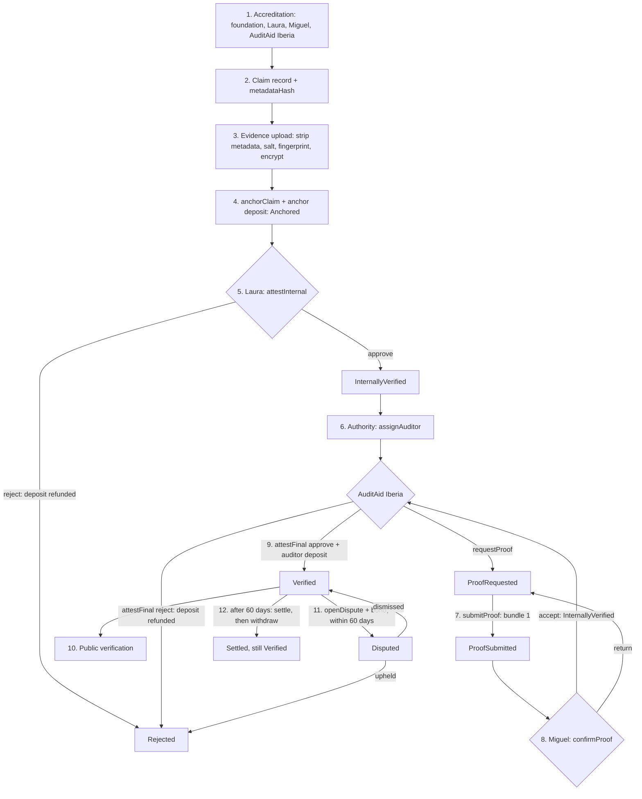
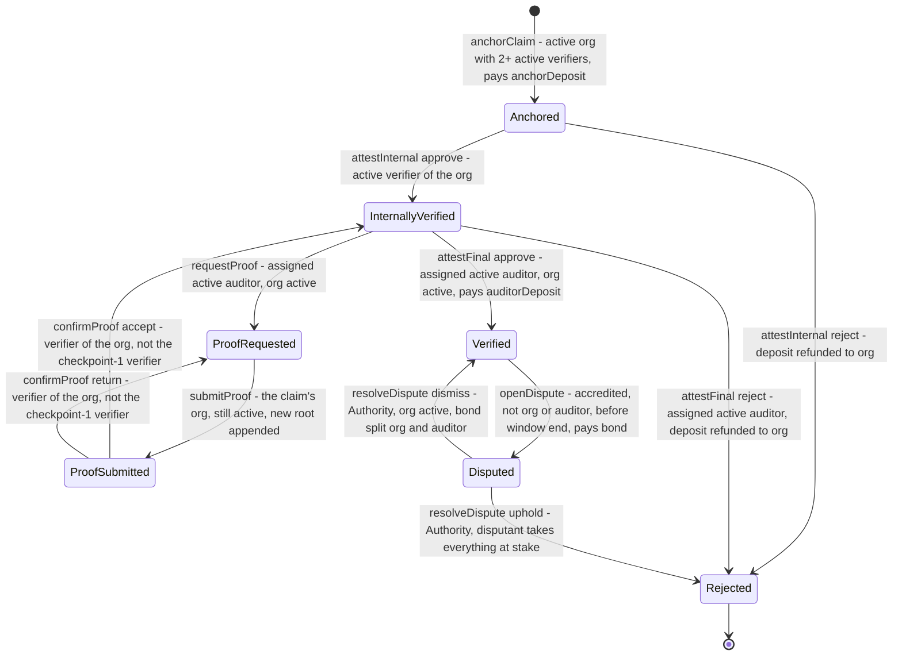
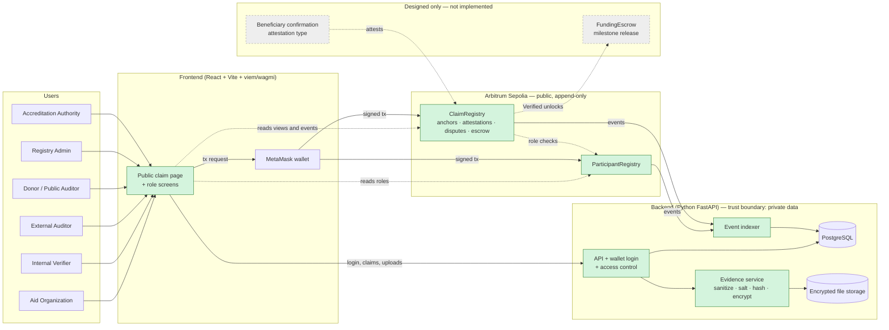

# Architecture

Describe the complete Proof of Aid system, including parts beyond the prototype.
Keep implementation status in [SUBMISSION.md](SUBMISSION.md).

> **Status:** design as built (2026-09-25, final submission), checked against the code on `main`:
> contracts with deposits, rewards and penalties deployed to Arbitrum Sepolia; evidence backend, chain
> indexer, public verification page and role screens implemented. Implementation status per
> capability lives in [SUBMISSION.md](SUBMISSION.md#implementation-boundary). Requirements and
> acceptance criteria live in [`dbv-specs-ops/docs/SPECIFICATIONS.md`](../dbv-specs-ops/docs/SPECIFICATIONS.md);
> how to build and run each part is in [`code/README.md`](../code/README.md) and [RUNBOOK.md](RUNBOOK.md).

**Contents:** [The case: 500 food kits after the Valencia floods](#the-case-500-food-kits-after-the-valencia-floods) ·
[Vision and actors](#vision-and-actors) ·
[Implementation focus](#implementation-focus) ·
[End-to-end flow](#end-to-end-flow) ·
[Claim lifecycle (enforced onchain)](#claim-lifecycle-enforced-onchain) ·
[Incentives: deposits, rewards and penalties (P9)](#incentives-deposits-rewards-and-penalties-p9) ·
[System diagram](#system-diagram) ·
[Stack](#stack) ·
[Components](#components) ·
[Data model](#data-model) ·
[Roles and permissions](#roles-and-permissions) ·
[Evidence pipeline](#evidence-pipeline) ·
[Public verification algorithm](#public-verification-algorithm) ·
[Indexer](#indexer) ·
[Configuration and deployment topology](#configuration-and-deployment-topology) ·
[Decisions and trade-offs](#decisions-and-trade-offs) ·
[Key ADRs](#key-adrs) ·
[Security considerations](#security-considerations) ·
[Known edge cases](#known-edge-cases) ·
[Technical appendix](#technical-appendix)

## The case: 500 food kits after the Valencia floods

After severe flooding in Valencia, the fictional Alimentos del Levante Foundation claims it delivered
500 food kits to 500 families, but its strongest evidence (delivery lists, photos) holds the
families' personal data. The foundation anchors salted fingerprints of its encrypted evidence onchain
and pays a deposit; its internal verifier Laura approves checkpoint 1; the auditor AuditAid Iberia,
accredited and assigned by the Regional Aid Oversight Authority, asks for more proof, which a second
verifier, Miguel, must confirm before the auditor approves with its own deposit. Any donor can then
re-check the published files against the chain in a browser, and for 60 days an accredited
participant other than the foundation or its auditor can dispute the claim by posting a bond. The
twelve-step walkthrough, its flowchart and the pitch message: [Appendix → A.1 The case in full](#a1-the-case-in-full).

## Vision and actors

The goal is that someone who does not trust the aid organization, like a donor reading the
foundation's 500-kit claim, can verify that the evidence has not changed since it was submitted and
was confirmed first by an internal verifier and then by an officially accredited external auditor,
without ever seeing beneficiaries' personal data. Five principles guide the design: verify rather
than trust, no personal data onchain, two-stage verification, append-only history, and a wallet is
not an identity. Seven actors take part: Registry Admin, Accreditation Authority, Aid Organization,
Internal Verifier, External Auditor, Beneficiary and Donor / Public Auditor. Principles and actor
table: [Appendix → A.2 Vision and actors](#a2-vision-and-actors).

## Implementation focus

Within the complete design we build **Trust, Evidence & Privacy**: how a third party can trust an
aid claim whose evidence cannot be published because it contains personal data. Our answer is
encrypted offchain evidence whose Merkle root is anchored onchain, a contract-enforced two-stage
verification with proof requests, bonded disputes by accredited participants, and a public page that
re-verifies evidence integrity without revealing personal data. Need, Funding, Delivery and Outcome
are designed but not implemented. The scope statement and our answers to the area's four questions:
[Appendix → A.3 Implementation focus](#a3-implementation-focus).

## End-to-end flow

The system follows `Need → Verification → Funding → Delivery → Outcome → Transparent history`; the
prototype implements verification and its history: accreditation, claim record, evidence upload,
anchoring, internal verification, external audit with proof requests, dispute, settlement and public
verification. In the case, these are the steps from registering the foundation to a donor
re-checking its invoice. Funding (donations released once a claim is `Verified`) and beneficiary
confirmation are designed only. The ten steps: [Appendix → A.4 End-to-end flow](#a4-end-to-end-flow).

## Claim lifecycle (enforced onchain)

`ClaimRegistry` enforces the claim's states (`Anchored`, `InternallyVerified`, `ProofRequested`,
`ProofSubmitted`, `Verified`, `Rejected`, `Disputed`), and any other transition reverts. In the case,
the foundation's `anchorClaim` creates the claim, Laura's `attestInternal` and Miguel's
`confirmProof` carry it through the internal checks, AuditAid Iberia's `attestFinal` verifies it, and
an upheld dispute would end it as `Rejected`, which is final. The state diagram, the order in which
guards are checked, and each function's caller, events and ETH movements: [Appendix → A.5 Claim lifecycle (enforced onchain)](#a5-claim-lifecycle-enforced-onchain).

## Incentives: deposits, rewards and penalties (P9)

### Who pays what, in plain words

Deposits make fraud and frivolous disputes cost money
([Incentives](#incentives-deposits-rewards-and-penalties-p9) has the exact rules):

- **The foundation** deposits a penalty plus the auditor's reward when it anchors the claim
  (1.01 ETH at the reference amounts; 0.0101 ETH on Arbitrum Sepolia).
- **AuditAid Iberia** deposits 0.1 ETH (0.001) when it approves. **A disputant** posts a 0.1 ETH
  (0.001) bond. Laura and Miguel put in nothing.
- **Rejected** at checkpoint 1 or by the auditor: the foundation gets its whole deposit back.
- **Dispute dismissed:** the disputant loses its bond, split half to the foundation and half to
  AuditAid Iberia.
- **Dispute upheld:** the disputant receives everything at stake: its bond, the foundation's
  penalty, the auditor's deposit and the reward (1.21 ETH at the reference amounts).
- **No dispute within 60 days:** after `settle`, the foundation recovers its penalty and AuditAid
  Iberia its deposit plus the reward.

Nothing is sent automatically: the contract credits each address, and each party pulls its money
with `withdraw()`.

Parameters, payout tables, escrow accounting, invariants and rules: [Appendix → A.6 Incentives: deposits, rewards and penalties (P9)](#a6-incentives-deposits-rewards-and-penalties-p9).

## System diagram

Every user works through a React frontend: the public claim page reads the contracts directly, and
every state change is a transaction signed in the user's own wallet, never by the backend. A FastAPI
backend, the trust boundary for private data, handles wallet login, the evidence service, PostgreSQL,
encrypted file storage and the event indexer. Two contracts on Arbitrum Sepolia, `ParticipantRegistry`
and `ClaimRegistry`, hold roles, anchors, attestations, disputes and escrow; the donor funding escrow
and beneficiary confirmation appear as designed-only parts. Diagram and notes: [Appendix → A.7 System diagram](#a7-system-diagram).

## Stack

Contracts are written in Solidity 0.8.30 with Foundry and OpenZeppelin and deployed on Arbitrum
Sepolia. The backend is Python (3.12 or later) with FastAPI, SQLAlchemy and Alembic, PostgreSQL,
web3.py, and the cryptography and Pillow libraries; the frontend is React 19 with Vite, wagmi and
viem. Every version is pinned in the repository's lock files. The full version table: [Appendix → A.8 Stack](#a8-stack).

## Components

Each part has a stated responsibility and trust assumption. The two contracts are the only source
of truth for roles, status, evidence roots and money; the backend and its evidence service are
trusted for confidentiality but not for integrity, because everything they serve can be checked
against the chain; manifests are untrusted by design and the database is not relied on for integrity.
The donor funding escrow and beneficiary confirmation are designed only. The component table: [Appendix → A.9 Components](#a9-components).

## Data model

Onchain, `ClaimRegistry` stores each claim's organization, status, checkpoint-1 verifier, auditor,
anchoring time and `metadataHash`, plus its append-only evidence roots, escrow state and each
account's withdrawable credits; `ParticipantRegistry` stores roles and each verifier's organization.
The backend's tables hold the claim text, evidence file rows with salted fingerprints and sealed
salts, sealed notes and login challenges; the indexer's tables hold chain events and their
projections. Interfaces and every table: [Appendix → A.10 Data model](#a10-data-model).

## Roles and permissions

Onchain, each function has a fixed set of callers: in the case, only the Registry Admin can register
the foundation, Laura and Miguel; only the Oversight Authority can accredit and assign AuditAid
Iberia and resolve disputes; only the assigned auditor can request proof or give the final
decision. In the backend API, private files are readable only by the claim's organization, its
verifiers and its assigned auditor, notes also by their own author, and a denied read of a private
file looks like a missing one. Both permission matrices: [Appendix → A.11 Roles and permissions](#a11-roles-and-permissions).

## Evidence pipeline

Every upload is cleaned of metadata (images re-encoded, PDFs rewritten), committed with a random
salt as SHA-256(salt ‖ file) and encrypted with AES-256-GCM under a per-claim key; the Merkle root
of the bundle is what the organization anchors. In the case, the foundation's seven files form
bundle 0 and the three supplementary files bundle 1. The upload steps and the frozen recipes for the
Merkle tree, manifests, `metadataHash`, the reviewer view and notes: [Appendix → A.12 Evidence pipeline](#a12-evidence-pipeline).

## Public verification algorithm

With no wallet and no login, the claim page reads status, roots and history from the contract,
accepts a file list only if its Merkle root matches the chain, and hashes dropped files in the
browser. In the case, a donor who drops the published invoice sees **Match**, and a copy with one
changed character gives **No match**; the claim's title and description are shown only if they
match the onchain `metadataHash`. The seven steps: [Appendix → A.13 Public verification algorithm](#a13-public-verification-algorithm).

## Indexer

A Python poller copies both contracts' events into PostgreSQL, idempotently and behind a
confirmation margin, and projects participants and claims that drive the backend's access rules and
the public timeline API. The public page uses it only as a speed-up and falls back to the chain.
Ranges, projections, reorgs and why `deployBlock` comes from receipts: [Appendix → A.14 Indexer](#a14-indexer).

## Configuration and deployment topology

Each layer reads its own `.env` created from a committed template, and contract addresses always come
from the deployment files in `code/shared/deployments/`. Two topologies are supported: a local anvil
chain whose clock can be moved, so settlement can be shown, and the public Arbitrum Sepolia
deployment. Every variable and both topologies: [Appendix → A.15 Configuration and deployment topology](#a15-configuration-and-deployment-topology).

## Decisions and trade-offs

The main decisions keep files and personal data offchain and put only evidence roots, attestations,
disputes, status and escrow onchain; fingerprint every file with a salt and anchor one Merkle root
per bundle; enforce two sequential verification stages; and let the public page read the chain
without a backend. Each has a trade-off: for example, the public cannot inspect private content, so
trust shifts to the accredited auditor. The decision table and assumptions: [Appendix → A.16 Decisions and trade-offs](#a16-decisions-and-trade-offs).

## Key ADRs

The key architecture decisions are logged with dates in
[`dbv-specs-ops/memory.md`](../dbv-specs-ops/memory.md). The appendix summarizes them, from building the
contracts first and freezing the Merkle recipe to permanent participant identity, chain-driven
evidence access, the P9 incentives and the P10 privacy follow-ups. The ADR table: [Appendix → A.17 Key ADRs](#a17-key-adrs).

## Security considerations

No user key reaches the backend (login is a signature over a one-time nonce). The contract checks
exact deposit amounts and pays out only through `withdraw()`, protected against reentrancy, with full
test coverage but no external audit; private files use per-claim keys and stay hidden from
unauthorized viewers. What the public page shows comes from the contract or is checked against it.
Keys, contract hardening, confidentiality, web settings and residual risks: [Appendix → A.18 Security considerations](#a18-security-considerations).

## Known edge cases

Some situations are allowed by the rules but may surprise a reader: an organization revoked
mid-review leaves its claim stuck with the deposit locked, a revoked auditor must be reassigned,
internal verifiers may dispute their own organization's claim, and a dispute opened in time can be
resolved after the window. In the case, Laura or Miguel could therefore dispute the foundation's
claim. The full list: [Appendix → A.19 Known edge cases](#a19-known-edge-cases).

## Technical appendix

The full text behind each brief section above, moved here unchanged.

### A.1 The case in full

This walkthrough follows one fictional but realistic claim through the whole system. The names are
invented; the rules are the ones the contracts and the backend enforce today. The recorded demo on
Arbitrum Sepolia runs the onchain steps, up to a dismissed dispute, on made-up receipts (see
[SUBMISSION.md](SUBMISSION.md#3-demo-and-validation)). Every mechanism named below links to its
detailed description, most of it in the [Technical reference](#technical-appendix) at the end of
this document.

**Situation.** After severe flooding in a region of Valencia, the Alimentos del Levante Foundation
distributes food kits (rice, legumes, oil, milk and canned food) to 500 affected families. It claims:

> "We delivered 500 food kits to 500 affected families between October 10 and 12."

The challenge is to prove this without publishing the families' names, national ID numbers,
addresses or identifiable photographs.

**Who is who** (see [Vision and actors](#vision-and-actors) and
[Roles and permissions](#roles-and-permissions)):

| In the case | Role in Proof of Aid |
| --- | --- |
| Alimentos del Levante Foundation | Aid Organization |
| Laura and Miguel | Internal Verifiers of the foundation, each with their own wallet |
| AuditAid Iberia | External Auditor |
| Regional Aid Oversight Authority | Accreditation Authority: accredits auditors, assigns one to each claim, resolves disputes |
| The platform operator | Registry Admin: registers organizations and their internal verifiers |
| A donor or a journalist | Donor / Public Auditor: reads the public claim page and signs nothing |
| The 500 families | Beneficiaries: their personal data never leaves private, encrypted storage |

### The claim, step by step

**1. Accreditation.** The Registry Admin registers the foundation's wallet as an organization and
Laura's and Miguel's wallets as its internal verifiers; the Oversight Authority accredits AuditAid
Iberia as an auditor. The foundation can anchor a claim only while it has at least two active
internal verifiers, and each wallet holds one participant role for life, so the wallet that submits
a claim can never approve it. The chain records which wallet may do what, never who the person is
([Roles and permissions](#roles-and-permissions), [Components](#components)).
*Virtue demonstrated:* separation of duties; no single person can invent an auditor or approve their
own claim.

**2. The claim record.** The foundation signs in to the backend with its wallet (a signature over a
one-time nonce; no key leaves the wallet) and records the claim: a title, a description (500 kits,
what each kit holds, the October 10–12 period, the approximate value), a region (never exact
coordinates) and one claim date. This text stays offchain in PostgreSQL. The backend returns the
claim ID, `keccak256` of the claim's UUID, and the `metadataHash`, one `keccak256` fingerprint over
title, description, region, date and claim ID, which later exposes any edit to the text
([`metadataHash` recipe](#metadatahash-recipe-p84-codesharedpoa_sharedmetadatapy),
[Data model](#data-model), [Backend API](#backend-api)).
*Virtue demonstrated:* the story lives offchain, its fingerprint onchain.

**3. Evidence upload.** The foundation uploads seven files as bundle 0: a supplier invoice, a
warehouse dispatch note and a distribution-point report (PDFs), an inventory of 500 kits (CSV) and
three photos of distribution points. For each file the backend first removes metadata (EXIF and GPS
from the photos; author, creator tool, dates, XMP and earlier revisions from the PDFs; the CSV is
stored as uploaded), then draws a random 32-byte salt and computes the file's fingerprint as the
salted commitment SHA-256(salt ‖ cleaned file). The salt is sealed and the file encrypted with
AES-256-GCM under a key derived for this claim. Names, ID numbers and signatures stay inside the
encrypted files; outsiders see a private file only as its fingerprint. The foundation may mark
non-personal files public, such as the supplier invoice, which also publishes that file's salt so
anyone can check it ([Evidence pipeline](#evidence-pipeline),
[Upload](#upload-post-claimsidevidence), [Manifests](#manifests-v1-and-v2-codesharedmanifestschemajson)).
*Virtue demonstrated:* privacy by design; the evidence can be reviewed without becoming a data leak.

**4. Anchoring.** The seven fingerprints become the leaves of one Merkle tree, whose root is the
bundle's `evidenceRoot` ([Merkle recipe](#merkle-recipe-frozen-in-p1-codesharedpoa_sharedmerklepy)).
The foundation's wallet signs `anchorClaim(claimId, evidenceRoot, metadataHash)` and pays the
anchor deposit, a penalty plus the auditor's future reward. The transaction emits `ClaimAnchored`,
`DepositLocked` and `StatusChanged` (`None → Anchored`). From now on a changed invoice, a replaced
photo or an edited CSV no longer matches the root recorded onchain
([Claim lifecycle](#claim-lifecycle-enforced-onchain),
[Incentives](#incentives-deposits-rewards-and-penalties-p9)).
*Virtue demonstrated:* verifiable immutability without putting private files onchain.

**5. First internal review (checkpoint 1).** Laura signs in on the claim page, opens *Evidence files
(authorized)*, downloads each file (the backend decrypts it for her) and presses *Check this file*:
her browser re-hashes the file with its salt and proves it against the onchain root
([Reviewer view](#reviewer-view-of-private-files-p102)). She checks that the invoice covers 500
kits, that the dispatch note matches the warehouse records and that the inventory has 500 entries,
then signs `attestInternal(claimId, true, justificationHash)`: `Anchored → InternallyVerified`. Her
written justification is salted in her browser and stored encrypted by the backend; only its
fingerprint, `keccak256(salt ‖ text)`, goes onchain ([Note recipe](#note-recipe-p103-codesharedpoa_sharednotespy)).
Had she rejected it, the claim would end `Rejected` and the foundation's deposit would be refunded.
*Virtue demonstrated:* the organization cannot approve its own claim.

**6. The auditor asks for more.** The Oversight Authority assigns AuditAid Iberia with
`assignAuditor(claimId, auditor)`; from then on only that auditor can act on the claim, and it can
open the private files. It finds that the distribution report confirms 500 kits but does not tie
each distribution point to a date. Instead of approving blindly or rejecting, it signs
`requestProof(claimId, requestHash)`, asking for confirmation from the coordinators of the three
distribution points: `InternallyVerified → ProofRequested`. The request text stays offchain;
`requestHash` is its salted fingerprint, so it cannot be rewritten later.
*Virtue demonstrated:* targeted evidence requests, all on the record.

**7. Supplementary evidence.** The foundation uploads three more files as bundle 1 (coordinators'
confirmations, a warehouse time log and a transport report for the three routes), cleaned, salted
and encrypted in the same way, and anchors their root with `submitProof(claimId, supplementaryRoot)`:
`ProofRequested → ProofSubmitted`. The original root is never replaced: `evidenceRoots(claimId)` now
returns two roots, the original evidence first and the supplementary evidence second.
*Virtue demonstrated:* corrections and additions are append-only.

**8. Second internal review.** Miguel reviews the new bundle. The contract would refuse Laura here
(`SameVerifierAsCheckpoint1`): supplementary proof must be confirmed by a different verifier than
the one who approved checkpoint 1. Miguel signs `confirmProof(claimId, true, justificationHash)`:
`ProofSubmitted → InternallyVerified`, back to the auditor. With `accept = false` the claim would
return to `ProofRequested`.
*Virtue demonstrated:* the four-eyes principle, even when answering an auditor.

**9. Final approval (checkpoint 2).** AuditAid Iberia reviews both bundles, the internal
justifications and the wallets' roles, then signs `attestFinal(claimId, true, justificationHash)`
and locks its own deposit: `InternallyVerified → Verified`. The approval starts a 60-day dispute
window. A rejection would pay nothing in and refund the foundation's deposit. The public page now
shows the claim as verified, with its internal check, independent auditor, final decision, dispute
state and the deposits held, and without any name, ID number, address, signature or private file.
*Virtue demonstrated:* trust rests on an attributable chain of responsibilities, not on the
organization's word.

**10. Public verification.** A donor opens the claim page with no wallet and no login. The browser
reads the status, the roots and the full history directly from `ClaimRegistry`
([Public verification algorithm](#public-verification-algorithm)); the [Indexer](#indexer) API is
only a speed-up, used when it provably matches the chain. The donor sees who signed each step and
that the auditor was assigned by the Authority; the contract has enforced the order of states and
the separation of wallets. For a file the foundation published, such as the supplier invoice, the
browser recomputes the salted fingerprint and compares it with the onchain root: the original
invoice shows **Match**, a copy with one changed character shows **No match**, without any access to
the private database. The title and description are shown only when they reproduce the onchain
`metadataHash`. Private files cannot be checked by the public, by design; only their fingerprints
are visible.
*Virtue demonstrated:* independent verification; nobody has to trust the backend's word.

**11. A later dispute.** Two weeks later an accredited participant, for example another accredited
auditor, has evidence that one distribution point received only 480 kits. Within the 60-day window
it signs `openDispute(claimId, counterEvidenceHash)` and posts the dispute bond:
`Verified → Disputed`. The foundation's wallet and AuditAid Iberia cannot dispute their own claim
(`CannotDisputeOwnClaim`); Laura and Miguel, as accredited verifiers, could
([Known edge cases](#known-edge-cases)). The Oversight Authority reviews the counter-evidence and
signs `resolveDispute(claimId, upheld, justificationHash)`: upheld → `Rejected`, which is final;
dismissed → `Verified` again. The approval, the dispute and the ruling all stay in the public
history.
*Virtue demonstrated:* transparency also applies when something goes wrong.

**12. Settlement.** Once 60 days have passed since the approval with no dispute open, anyone may call
`settle(claimId)`: the deposits are credited, and each party collects its money with `withdraw()`.
A settled claim can never be disputed again.

### The whole flow

The diagram follows the contract's real states; the step numbers match the walkthrough. Settlement is
not a status: the claim stays `Verified` and is marked settled.



> Proof of Aid does not prove that a photograph is inherently truthful. It proves that the evidence
> reviewed is the same evidence that was submitted, who reviewed it, which controls were performed,
> and how the decision evolved over time.

The case exercises *Verification*, *Evidence & Privacy* and *Transparent history*. Releasing donor
funding automatically after `Verified` and letting beneficiaries confirm receipt are designed (see
[Components](#components)) but not implemented.

### A.2 Vision and actors

**Goal:** someone who does not trust the aid organization can independently verify that an aid claim is backed by
evidence that (a) has not been altered since it was submitted and (b) was confirmed by the organization's internal
verifier and finally approved by an officially accredited external auditor, **without** that person ever seeing beneficiaries' personal data.

**Design principles**

1. **Verify, don't trust:** every trust-relevant state change is signed by a wallet and recorded onchain; everything else stays offchain.
2. **No personal data onchain:** only hashes/commitments that cannot be reversed into personal data are published.
3. **Two-stage verification:** a claim is only "Verified" after an internal verifier of the organization confirms it (first checkpoint) **and** an external, officially accredited auditor gives the final confirmation.
4. **Append-only history:** corrections, rejections and disputes are new events; nothing is overwritten.
5. **Wallet ≠ identity:** a wallet proves key control; accreditation links a wallet to a real-world organization.

**Actors**

| Actor | Role |
| --- | --- |
| **Registry Admin** | Registers organizations and their internal verifier accounts (maps wallets to real-world entities). A platform or consortium operator role. |
| **Accreditation Authority** | Official body that approves external auditors onchain, assigns one auditor to each internally verified claim, and resolves disputes. Deliberately a separate role from the Registry Admin (e.g. a public audit oversight body), so no single party both registers organizations and chooses their auditors. |
| **Aid Organization** | Registers needs and aid claims, uploads evidence, anchors evidence hashes onchain, answers auditors' proof requests. |
| **Internal Verifier** | Verified account belonging to the organization. First checkpoint: promptly confirms (or rejects) that the aid was provided correctly. When the auditor requests proof, a **second** internal verifier (different from the one who approved at checkpoint 1) confirms the supplementary proof before it returns to the auditor. Always a different wallet from the one that submitted the claim (separation of duties), so each organization registers at least two internal verifiers. |
| **External Auditor** | Independent auditor approved by the Accreditation Authority and assigned to the claim by it. Can request additional proof from the organization and gives the final confirmation (or rejection). |
| **Beneficiary** | Receives aid. Personal data is protected; in the future (Delivery & Impact) can confirm or challenge receipt. |
| **Donor / Public Auditor** | Unauthenticated third party that inspects a claim's timeline and verifies evidence integrity and attestations. |

### A.3 Implementation focus

> Within our complete Proof of Aid design, we focus on **Trust, Evidence & Privacy**, addressing **how a third party can trust an aid claim whose evidence contains beneficiaries' personal data and therefore cannot be published** through **offchain encrypted evidence whose Merkle root is anchored onchain, a contract-enforced two-stage verification (internal verifier → independent, officially accredited auditor with proof requests), accredited disputes, and a public page that re-verifies evidence integrity without revealing personal data**.

How the design answers the area's questions:

| Question | Answer in this design |
| --- | --- |
| **Who verifies claims?** | An internal verifier of the organization (fast first checkpoint, never the submitter), then an external auditor accredited **and assigned** by an independent Accreditation Authority (final say). Supplementary proof is confirmed by a second internal verifier. |
| **How is evidence checked?** | Each file is fingerprinted after metadata stripping as a salted commitment SHA-256(salt ‖ bytes); the bundle's Merkle root is anchored onchain before review. Verifiers, auditors and the public recompute hashes and compare against the onchain root; any change after anchoring is a mismatch. |
| **How is it disputed?** | Any accredited participant other than the claim's own organization and approving auditor can dispute a `Verified` claim within 60 days, posting a bond and a counter-evidence hash; the Accreditation Authority resolves it; the whole history stays public and append-only. Deposits make fraud and frivolous disputes cost money (see *Incentives*). |
| **How is it kept private?** | Files stay offchain, encrypted at rest, decryptable only by the organization, its internal verifiers and the assigned auditor. Image metadata (EXIF/GPS) is stripped. Nothing personal (not even hashes of names or IDs) goes onchain; the organization may publish individual non-personal files. |

The rest of the flow (Need, Funding, Delivery, Outcome) is designed below but **not implemented**.

### A.4 End-to-end flow

`Need → Verification → Funding → Delivery → Outcome → Transparent history`. Steps in **bold** are the prototype's focus (Trust, Evidence & Privacy).

1. **Accreditation** — Registry Admin registers organization wallets and their internal verifier wallets onchain (`ORGANIZATION_ROLE`, `INTERNAL_VERIFIER_ROLE` linked to an organization); the Accreditation Authority approves external auditor wallets (`AUDITOR_ROLE`).
2. **Need / claim creation** — The organization signs in to the backend with its wallet and creates a claim (e.g. "500 food kits delivered in district X"): title, description, region (never exact coordinates) and date are stored in PostgreSQL; the backend returns the claim ID `keccak256(uuid)` and the `metadataHash`.
3. **Evidence upload** — The organization uploads evidence files (photos, receipts, signed delivery lists) into bundle 0. The backend strips image metadata, computes a salted fingerprint per file, SHA-256(salt ‖ sanitized bytes) with a random 32-byte salt sealed with the claim key, encrypts the file at rest and returns the bundle's Merkle root.
4. **Evidence anchoring** — The organization's wallet calls `anchorClaim(claimId, evidenceRoot, metadataHash)`, locking its deposit (see *Incentives*). `ClaimAnchored` is emitted.
5. **Internal verification (checkpoint 1)** — An internal verifier of the same organization reviews the evidence, checks it against the onchain root and calls `attestInternal` (`approve` / `reject` + justification hash). Approval → `InternallyVerified`; rejection → `Rejected` and the deposit is refunded.
6. **External audit (checkpoint 2)** — The Accreditation Authority assigns an accredited auditor (`assignAuditor`); only that auditor can act on the claim. If the evidence is insufficient, the auditor opens a **proof request** (`requestProof`, hash of the request text) → `ProofRequested`. The organization uploads bundle n and anchors its root (`submitProof`) → `ProofSubmitted`; a second internal verifier, different from the checkpoint-1 verifier, accepts it (→ `InternallyVerified`, back to the auditor) or returns it (→ `ProofRequested`). The auditor then calls `attestFinal`: `approve` (locks the auditor's deposit) → `Verified`, `reject` → `Rejected`.
7. **Dispute** — Within 60 days of the approval, an accredited participant (not the claim's organization or its approving auditor) posts a bond and a hash of counter-evidence (`openDispute`) → `Disputed`, until the Accreditation Authority resolves it (`resolveDispute`: upheld → `Rejected`, dismissed → `Verified`). After the window anyone can `settle` the claim, which releases the deposits; a settled claim can never be disputed.
8. *Funding (design only)* — Donations are escrowed and released per milestone once the related claim is `Verified`.
9. *Delivery & Impact (future)* — Beneficiary confirmation of receipt (e.g. signed acknowledgement or one-time code) is added as an additional attestation type.
10. **Public verification & history** — The public claim page reads status, evidence roots, escrow and the full event history **directly from `ClaimRegistry`** (no server in between), and lets anyone re-hash files in the browser against the onchain roots. Per-bundle file lists (manifests) come from the backend or the app's static files and are accepted only if their recomputed root matches the chain. An event indexer into PostgreSQL feeds the backend's access rules and a public timeline API; for the page it is an optional speed-up, never the source of truth.

### A.5 Claim lifecycle (enforced onchain)

`ClaimStatus` (uint8 in the ABI, order frozen in `code/shared/abi/claim-status.json`):
`None = 0` (does not exist), `Anchored = 1`, `InternallyVerified = 2`, `ProofRequested = 3`,
`ProofSubmitted = 4`, `Verified = 5`, `Rejected = 6`, `Disputed = 7`. `Rejected` is final.



Every transition emits the action event first, then `StatusChanged(claimId, from, to)`. Guards are
checked in this order in every action: claim exists (`ClaimNotFound`) → status (`InvalidStatus`) →
caller → claim's organization still active (only where the action can lead to `Verified`, plus
`requestProof`) → non-zero hashes (`ZeroValue`) → exact `msg.value` (`WrongDepositAmount`).

| Function | Caller and guards | Status | Events | ETH |
| --- | --- | --- | --- | --- |
| `anchorClaim(claimId, evidenceRoot, metadataHash)` payable | claim ID unused (`ClaimAlreadyExists`); caller is an active organization (`NotActiveOrganization`) with ≥ 2 active internal verifiers (`InsufficientInternalVerifiers`); non-zero ID, root and hash; `msg.value == anchorDeposit()` | `None → Anchored` | `ClaimAnchored`, `DepositLocked`, `StatusChanged` | organization pays penalty + reward |
| `attestInternal(claimId, approve, justificationHash)` | `organizationOf(caller) == claim.organization` (`NotOrganizationVerifier`; zero for a revoked verifier or a verifier of a revoked organization); non-zero justification. Records `claim.internalVerifier` | `Anchored → InternallyVerified` / `Rejected` | `InternalAttestation`, (`Credited`), `StatusChanged` | reject: organization credited its whole deposit |
| `assignAuditor(claimId, auditor)` | status `InternallyVerified`, `ProofRequested` or `ProofSubmitted`; caller is an Accreditation Authority (`NotAccreditationAuthority`); `auditor` is an active auditor (`NotActiveAuditor`). Reassignment allowed | unchanged | `AuditorAssigned(claimId, auditor, previousAuditor)` | none |
| `requestProof(claimId, requestHash)` | caller is `claim.auditor` (`NotAssignedAuditor`) and still accredited (`NotActiveAuditor`); claim's organization active; non-zero hash | `InternallyVerified → ProofRequested` | `ProofRequested`, `StatusChanged` | none |
| `submitProof(claimId, supplementaryRoot)` | caller is `claim.organization` (`NotClaimOrganization`) and still active; non-zero root; root appended at index `n` | `ProofRequested → ProofSubmitted` | `ProofSubmitted(…, rootIndex)`, `StatusChanged` | none |
| `confirmProof(claimId, accept, justificationHash)` | verifier of the claim's organization; not `claim.internalVerifier` (`SameVerifierAsCheckpoint1`); non-zero justification | `ProofSubmitted → InternallyVerified` / `ProofRequested` | `ProofReviewed`, `StatusChanged` | none |
| `attestFinal(claimId, approve, justificationHash)` payable | assigned, active auditor; approve also needs the organization active; non-zero justification; `msg.value` = `auditorDeposit()` (approve) or 0 (reject). Approve sets `verifiedAt` once | `InternallyVerified → Verified` / `Rejected` | `FinalAttestation`, `DepositLocked` or `Credited`, `StatusChanged` | approve: auditor pays deposit; reject: organization credited its deposit |
| `openDispute(claimId, counterEvidenceHash)` payable | `isAccredited(caller)` (`NotAccredited`); caller is neither `claim.organization` nor `claim.auditor` (`CannotDisputeOwnClaim`); `block.timestamp < verifiedAt + disputeWindow` (`DisputeWindowClosed`); non-zero hash; `msg.value == disputeBond()` | `Verified → Disputed` | `DisputeOpened`, `DepositLocked`, `StatusChanged` | disputant pays bond |
| `resolveDispute(claimId, upheld, justificationHash)` | caller is an Accreditation Authority; dismiss also needs the organization active; non-zero justification | `Disputed → Rejected` (upheld) / `Verified` (dismissed) | `DisputeResolved`, `Credited` ×1 or ×2, `StatusChanged` | see *Incentives* |
| `settle(claimId)` | anyone; status `Verified`; not settled (`AlreadySettled`); `block.timestamp ≥ verifiedAt + disputeWindow` (`DisputeWindowOpen`) | unchanged; `settled = true` | `Credited` ×2, `ClaimSettled` | organization and auditor credited |
| `withdraw()` | anyone with credits (`NothingToWithdraw`); transfer must succeed (`WithdrawFailed`); `nonReentrant` | — | `Withdrawn` | sends all of the caller's credits |

Views: `participantRegistry()`, `getClaim`, `statusOf`, `evidenceRoots`, the parameter getters
(`auditorReward`, `auditorDeposit`, `organizationPenalty`, `disputeBond`, `disputeWindow`,
`anchorDeposit`), `credits(account)`, `verifiedAt`, `disputeWindowClosesAt` (0 if never verified),
`settled`, `lockedOf`.

### A.6 Incentives: deposits, rewards and penalties (P9)

Fraud has to cost more than it pays, and a dispute must not be free. `ClaimRegistry` therefore holds
native ETH in escrow per claim. The two internal verifiers stay out of it: checkpoint 1 involves no
money. Payouts are pull-only: the contract credits an address and the owner calls `withdraw()`.

| Parameter (immutable, non-zero) | Reference | Arbitrum Sepolia and deploy scripts (1/100) |
| --- | ---: | ---: |
| `organizationPenalty` | 1 ETH | 0.01 ETH |
| `auditorReward` | 0.01 ETH | 0.0001 ETH |
| `anchorDeposit()` = penalty + reward | 1.01 ETH | 0.0101 ETH |
| `auditorDeposit` | 0.1 ETH | 0.001 ETH |
| `disputeBond` | 0.1 ETH | 0.001 ETH |
| `disputeWindow` | 60 days | 60 days (5,184,000 s) |

| Moment | Who pays in | Amount (reference / Sepolia) |
| --- | --- | --- |
| `anchorClaim` | Organization | penalty + auditor reward: 1.01 ETH / 0.0101 ETH |
| `attestFinal` approve | Auditor | auditor deposit: 0.1 ETH / 0.001 ETH (reject: nothing) |
| `openDispute` (only before `verifiedAt + 60 days`) | Disputant | dispute bond: 0.1 ETH / 0.001 ETH |

| Outcome | Organization gets | Auditor gets | Disputant gets |
| --- | --- | --- | --- |
| Rejected at checkpoint 1 or by the auditor | its whole deposit back (1.01 / 0.0101) | — (put nothing in) | — |
| Dispute dismissed (claim back to `Verified`) | half the bond plus the odd wei (0.05 / 0.0005) | half the bond, rounded down (0.05 / 0.0005) | nothing (loses the bond) |
| Dispute upheld (claim `Rejected`) | nothing | nothing | bond + penalty + auditor deposit + reward (1.21 / 0.0121) |
| `settle` after the window, no open dispute (anyone may call) | its penalty back (1 / 0.01) | its deposit + the reward (0.11 / 0.0011) | — |

**Escrow accounting.** Nothing per claim is stored as an amount: `lockedOf(claimId)` is derived from
the status and the immutables: `Anchored`, `InternallyVerified`, `ProofRequested`, `ProofSubmitted`
→ `anchorDeposit`; `Verified` not settled → `anchorDeposit + auditorDeposit`; `Disputed` →
`anchorDeposit + auditorDeposit + disputeBond`; `None`, `Rejected`, settled → 0. The only stored
money state is `credits(account)` and, per claim, `verifiedAt`, `settled` and the open dispute's
disputant.

**Invariants** (fuzzed in `code/contracts/test/invariant/ClaimRegistry.invariant.t.sol`, 128 runs × 64
random calls): contract balance `== Σ credits + Σ lockedOf == Σ accepted − Σ withdrawn`; a settled
claim is past its window; a claim never returns to `None`; only declared transitions happen; a
`Verified` claim has both checkpoints; evidence roots only grow; claim ownership is immutable; a
revoked organization's claim never becomes `Verified`; participant identity is permanent.

**Pull-payment pattern.** `withdraw` is the only function that sends ETH. It zeroes the caller's
credit, emits `Withdrawn`, then transfers with a low-level call (checks-effects-interactions) under
OpenZeppelin `ReentrancyGuard`; a failing receiver reverts only its own withdrawal. No function loops
over claims, every other function is non-payable or checks the exact value, and the contract has no
`receive`, so ETH cannot arrive outside the escrow rules.

Rationale and rules:

- The organization prepays the auditor's reward, so an honest approval is always paid. If the claim
  turns out fraudulent, that reward goes to the disputant rather than back to the organization: the
  organization committed the fraud, and the auditor who approved it loses its deposit too.
- The window starts once, at the approval (`verifiedAt`); a dismissed dispute does not restart it,
  so repeat disputes cost a bond each and end after 60 days. At most one dispute is open at a time
  (the `Disputed` status), and one opened in time can be resolved after the window (settlement waits
  for it).
- The claim's organization and its approving auditor cannot dispute their own claim: an upheld
  self-dispute would pay the forfeited deposits back to the wrongdoers.
- The Accreditation Authority remains the judge; replacing it with decentralized arbitration (Kleros)
  is the designed next step (see [SUBMISSION.md](SUBMISSION.md#next-step-kleros-arbitration-designed-not-implemented)).

### A.7 System diagram



Every state-changing onchain action (accreditation, auditor assignment, anchoring, attestations,
proof requests, disputes, settlement, withdrawal) is a transaction signed in the user's own wallet;
the contracts authorize it by the signer's role. The backend never holds user keys: login is a
signature over a nonce. The Donor / Public Auditor only reads and never signs. The public page does
not depend on the indexer: it reads the contract directly and uses the indexer's API only as a
speed-up. The scripted demo on Arbitrum Sepolia was signed by `DemoLifecycle.s.sol` with test wallets.

### A.8 Stack

Versions as pinned in the repository (`foundry.toml`, `soldeer.lock`, `pyproject.toml` + `uv.lock`,
`package.json` + `pnpm-lock.yaml`) and as checked on 2026-09-25.

| Layer | Technology | Version |
| --- | --- | --- |
| Contracts | Solidity (EVM `cancun`, optimizer 200 runs) | 0.8.30 |
| | Foundry (`forge`, `cast`, `anvil`), Soldeer for dependencies | 1.8.3 |
| | OpenZeppelin Contracts (`AccessControl`, `ReentrancyGuard`; `MerkleProof` in tests) | 5.7.0 |
| | forge-std | 1.16.2 |
| Network | Arbitrum Sepolia (chain ID 421614); local anvil (31337) | — |
| Backend | Python (`requires-python >= 3.12`; checked with 3.14), uv | uv 0.11 |
| | FastAPI / Uvicorn | 0.141.1 / 0.53.0 |
| | Pydantic / pydantic-settings | 2.13.5 / 2.15.0 |
| | SQLAlchemy / Alembic / psycopg | 2.0.54 / 1.20.0 / 3.3.6 |
| | web3.py (indexer) / eth-account (login) | 8.0.0 / 0.14.0 |
| | cryptography (AES-GCM, HKDF) / Pillow (metadata strip) / itsdangerous (sessions) | 50.0.1 / 12.3.0 / 2.2.0 |
| | PostgreSQL | 16 in `docker-compose.yml`; 18.6 also checked |
| Shared recipe | `proof-of-aid-shared` (`poa_shared`), pycryptodome for keccak | 0.1.0 / 3.23.0 |
| Frontend | Node.js (Vite 8 needs 20.19+ or 22.12+; checked with 26), pnpm (pinned `packageManager`) | pnpm 12.6.0 |
| | React / React Router | 19.3.0 / 7.18.4 |
| | wagmi / viem / TanStack Query | 3.7.7 / 2.56.8 / 5.103.2 |
| | zod | 4.6.5 |
| | Vite / TypeScript / Vitest / oxlint / jsdom | 8.3.0 / 6.0.3 / 5.0.1 / 1.85.0 / 30.1.1 |

### A.9 Components

Each component with its responsibility and what it is trusted for.

| Component | Responsibility | Technology / approach | Trust assumption |
| --- | --- | --- | --- |
| `ParticipantRegistry` contract | Wallet roles (`ORGANIZATION_ROLE`, `INTERNAL_VERIFIER_ROLE` + organization link, `AUDITOR_ROLE`); two role admins (`REGISTRY_ADMIN_ROLE`, `ACCREDITATION_AUTHORITY_ROLE`); permanent participant identity | Solidity + OpenZeppelin `AccessControl` | Trusted for who holds which role. The two admins are trusted to map wallets to real entities (no KYC) |
| `ClaimRegistry` contract | Claim anchors, evidence roots, two-stage attestations, auditor assignment, proof requests, lifecycle state machine, disputes, escrow and payouts | Solidity, Foundry tests (unit, fuzz, invariants) | The only source of truth for status, roots and money; the Authority is trusted as assigner and judge |
| Backend API | Wallet-signature login, claims, evidence uploads per bundle, role-based access to private files, public claim view (private files as fingerprints only), per-bundle manifests, public chain-index API | Python — FastAPI + Pydantic v2, separate response models per viewer | Trusted for **confidentiality** (it holds the master key) and availability; **not** for integrity: everything it serves is checkable against the chain |
| Evidence service | Image and PDF metadata stripping before hashing, salted SHA-256 commitment per file (salt sealed with the claim key, per-claim HMAC for duplicate detection), one Merkle root per bundle (`root_index` 0 = original, n = supplementary proof n), AES-256-GCM at rest with a per-claim key; the text and salt of reviewer notes sealed with the same claim key (P10.3) | Python (`app/services/*`, `poa_shared` recipe) | Same as the backend |
| Evidence manifest | Per-bundle list of file fingerprints (`version` 1 or 2, `claimId`, `rootIndex`, `files[{sha256, public, name?, salt?}]`); names and salts only for public files | JSON Schema `code/shared/manifest.schema.json`, mirrored in zod and Pydantic | Untrusted by design: the page accepts one only if its recomputed root equals the onchain root |
| Event indexer | Copies both registries' events into `chain_events` and projects `chain_participants` and `chain_claims`, which drive the backend's access rules (`ROLE_SOURCE=chain`) and the public timeline API | Python + web3.py RPC polling from `deployBlock`, idempotent per (chain, tx hash, log index), confirmation margin, automatic range halving | Trusted by the backend for roles (lags the chain); never the source of truth for the public page |
| Database | Operational data (claims, file rows, login challenges), indexed events and projections | PostgreSQL (SQLite in tests) | Could be tampered with; the page does not rely on it for integrity |
| File storage | Encrypted evidence files `<random>.enc` | Local folder `STORAGE_DIR` (MinIO/S3 is the production path) | Holds ciphertext only |
| Frontend: public claim page | Status, claim record, verification summary, deposits and timeline read from the contract (or from the indexer API when provably up to date); in-browser verification of single files (via a verified manifest) or whole bundles; claim text checked against the onchain `metadataHash`; for signed-in reviewers, the *Evidence files (authorized)* and *Notes (authorized)* sections (P10.2, P10.3) | React + Vite + TypeScript + viem | Runs in the visitor's browser; files never leave it (private files are downloaded only by authorized reviewers and checked in their browser) |
| Frontend: role screens | Role read from `ParticipantRegistry`; per-claim actions planned from `ClaimRegistry`'s rules; every call simulated, then signed; payable amounts read from the contract; records and proofs go through the evidence service before anchoring; every note is salted in the browser and, with the evidence service, stored before its fingerprint is anchored (P10.3) | wagmi + viem + MetaMask (injected wallet) | The contract remains the authority: the planner only hides impossible actions |
| Shared recipe | Merkle, metadata and note recipes, test vectors, ABIs, deployment files | `code/shared/` | Frozen by vectors every layer must pass |
| `FundingEscrow` contract *(designed only)* | Holds donations per claim milestone; releases funds only when the linked claim is `Verified` and not `Disputed` | Solidity, reads `ClaimRegistry` status | Makes verification economically meaningful for donors |
| Beneficiary confirmation *(designed only, Delivery & Impact)* | Beneficiary acknowledges or challenges receipt through a one-time code redeemed by the backend into an attestation, without exposing their identity | Backend + new attestation type in `ClaimRegistry` | Closes the gap between delivery evidence and the recipient's own voice |

### A.10 Data model

### Onchain

`ClaimRegistry` (interface `code/contracts/src/interfaces/IClaimRegistry.sol`):

```solidity
enum ClaimStatus { None, Anchored, InternallyVerified, ProofRequested, ProofSubmitted, Verified, Rejected, Disputed }

struct Claim {                 // getClaim(claimId)
    address organization;      // anchoring wallet, immutable
    ClaimStatus status;
    address internalVerifier;  // checkpoint-1 wallet; cannot confirm supplementary proof
    address auditor;           // assigned by the Authority; address(0) until assigned
    uint64 anchoredAt;         // block.timestamp of anchorClaim
    bytes32 metadataHash;      // keccak256 of the claim text (recipe below)
}

// private storage
mapping(bytes32 => Claim) _claims;
mapping(bytes32 => bytes32[]) _evidenceRoots;   // [0] original, [n] supplementary proof n; append-only
mapping(bytes32 => Escrow) _escrows;            // Escrow { uint64 verifiedAt; bool settled; address disputant; }
mapping(address => uint256) _credits;           // withdrawable wei per account
// immutables: participant registry, auditorReward, auditorDeposit, organizationPenalty, disputeBond, disputeWindow
```

`MIN_INTERNAL_VERIFIERS = 2`. `claimId = keccak256(bytes(uuid))`; `claimId` is the first indexed
topic of every `ClaimRegistry` event except `Withdrawn`.

`ParticipantRegistry`: OpenZeppelin role membership plus `_verifierOrganization[verifier]`,
`_linkedVerifierCount[organization]` and `_wasParticipant[account]` (never cleared: permanent
identity). Views `isOrganization`, `organizationOf` (zero unless the verifier and its organization
are both active), `activeVerifierCount` (0 for a revoked organization), `isAuditor`,
`isAccreditationAuthority`, `isRegistryAdmin`, `isAccredited` (active organization, verifier of an
active organization, or auditor). Events: `OrganizationRegistered/Revoked`,
`InternalVerifierRegistered/Revoked`, `AuditorAccredited/Revoked`. Errors: `ZeroAddress`,
`AlreadyAccredited`, `NotActiveOrganization`, `NotActiveInternalVerifier`, `NotActiveAuditor`, plus
OpenZeppelin's `AccessControlUnauthorizedAccount` and `AccessControlBadConfirmation`.

### Backend tables (Alembic migrations 0001–0005)

Addresses and hashes are stored lowercase (`0x` + hex). Models in `code/backend/app/models.py`.

| Table | Migration | Columns | Notes |
| --- | --- | --- | --- |
| `claims` | 0001 | `id` UUID PK (the claim's UUID), `claim_id_hex` unique (`keccak256(uuid)`), `title` ≤ 200, `description`, `location_region` ≤ 120, `claim_date`, `metadata_hash_hex`, `created_by` (organization wallet), `auditor_address` (local mode only), `created_at` | Text is stored exactly as hashed (trimmed once) |
| `evidence_files` | 0001, `root_index` in 0002, `salt_sealed` + `dedup_tag_hex` in 0004 | `id` UUID, `claim_id` FK (cascade), `sha256_hex` (the salted commitment, or plain SHA-256 on legacy rows), `salt_sealed` (AES-GCM of the salt; NULL = legacy unsalted), `dedup_tag_hex`, `storage_name`, `original_name` (sanitized), `mime_type`, `size_bytes`, `is_public`, `root_index ≥ 0`, `uploaded_by`, `uploaded_at` | Unique `(claim_id, sha256_hex)` and `(claim_id, dedup_tag_hex)` |
| `participants` | 0001 | `address` PK, `role` (`organization` / `internal_verifier` / `auditor`), `organization`, `active` | Hand-seeded fallback for `ROLE_SOURCE=local` only |
| `challenges` | 0001 | `id`, `address`, `nonce` unique, `message`, `expires_at`, `used` | Single-use login nonces |
| `claim_notes` | 0005 | `id` UUID, `claim_id` FK (cascade), `kind` (`justification` / `proof_request` / `counter_evidence` / `resolution`), `author` (session wallet), `note_hash_hex`, `text_sealed`, `salt_sealed` (AES-GCM with the claim key), `created_at` | Unique `(claim_id, note_hash_hex)`; text and salt never stored in clear (P10.3) |

### Indexer tables (migration 0003)

| Table | Key | Content |
| --- | --- | --- |
| `chain_events` | unique `(chain_id, tx_hash, log_index)` | `block_number`, `contract`, `event_name`, `claim_id_hex`, decoded `args` (JSON), `block_time` |
| `sync_state` | `(chain_id, contracts)` (`participant,claim` addresses) | `deploy_block`, `cursor_block` (last fully stored block), `head_block` (latest head seen), `updated_at` |
| `chain_participants` | `(chain_id, address)` | `role`, `organization`, `active`, `updated_block` |
| `chain_claims` | `(chain_id, claim_id_hex)` | `organization`, `status` (name), `internal_verifier`, `auditor`, `evidence_roots` (JSON), `metadata_hash`, `anchored_block/at`, `last_status_block/at` |

Everything is keyed by chain ID, so one database can hold anvil and Arbitrum Sepolia side by side.

### A.11 Roles and permissions

### Onchain

✓ = may call; conditions in the lifecycle table above.

| Function | Registry Admin | Accreditation Authority | Organization | Internal verifier | Auditor | Anyone |
| --- | :---: | :---: | :---: | :---: | :---: | :---: |
| `registerOrganization`, `revokeOrganization`, `registerInternalVerifier`, `revokeInternalVerifier` | ✓ | | | | | |
| `accreditAuditor`, `revokeAuditor` | | ✓ | | | | |
| `grantRole` / `revokeRole` / `renounceRole` of its own admin role (hand-over; fresh wallets only) | ✓ | ✓ | | | | |
| `anchorClaim` | | | ✓ (active, ≥ 2 verifiers) | | | |
| `submitProof` | | | ✓ (the claim's, active) | | | |
| `attestInternal` | | | | ✓ (of the claim's organization) | | |
| `confirmProof` | | | | ✓ (not the checkpoint-1 verifier) | | |
| `assignAuditor`, `resolveDispute` | | ✓ | | | | |
| `requestProof`, `attestFinal` | | | | | ✓ (assigned, active) | |
| `openDispute` | | | ✓ (not its own claim) | ✓ | ✓ (not the approving auditor) | |
| `settle`, `withdraw`, all views | ✓ | ✓ | ✓ | ✓ | ✓ | ✓ |

`grantRole`, `revokeRole` and `renounceRole` revert (`AccessControlBadConfirmation`) for the three
participant roles, so links and counts cannot drift. Nobody holds `DEFAULT_ADMIN_ROLE`. The
constructor rejects the same wallet as Registry Admin and Accreditation Authority. A wallet that ever
held a participant role, or holds an admin role, can never receive another participant or admin role.

### Backend API

"Organization" means the wallet that created the claim, still an active organization in the role
source; "verifier" an active internal verifier of that organization while the organization is
active; "auditor" the auditor assigned onchain (chain mode) or in `claims.auditor_address` (local
mode). In chain mode the auditor also needs the claim to be anchored onchain by the organization that
created it. A logged-in session is a signed cookie set by `POST /auth/verify`.

| Method and path | Anonymous | Logged-in, other wallet | Organization | Verifier | Auditor | Errors |
| --- | :---: | :---: | :---: | :---: | :---: | --- |
| `GET /health` | ✓ | ✓ | ✓ | ✓ | ✓ | — |
| `POST /auth/challenge`, `POST /auth/verify`, `POST /auth/logout` | ✓ | ✓ | ✓ | ✓ | ✓ | 400 bad address, 401 no valid challenge / bad signature |
| `GET /auth/me` | | ✓ | ✓ | ✓ | ✓ | 401 |
| `POST /claims` | | active organization only | ✓ | | | 401, 403, 422 |
| `GET /claims/{id}` | public view | public view | full view + salts | full view + salts | full view + salts | 404 |
| `POST /claims/{id}/notes` (`kind`, `text`, `salt`, `note_hash`) | | ✓ (as author) | ✓ | ✓ | ✓ | 401, 404 claim, 409 same fingerprint, 422 hash ≠ keccak256(salt ‖ text) |
| `GET /claims/{id}/notes` | | own notes | all notes | all notes | all notes | 401, 404 |
| `GET /claims/{id}/bundles/{n}/manifest` | ✓ | ✓ | ✓ | ✓ | ✓ | 404 claim or bundle |
| `POST /claims/{id}/evidence` (multipart `files`, `public`, `root_index`) | | | ✓ | | | 401, 403, 404, 409 duplicate / sealed / gap, 413 > 25 MiB, 422 |
| `GET /files/{id}` public file | ✓ | ✓ | ✓ | ✓ | ✓ | 404 |
| `GET /files/{id}` private file | | | ✓ | ✓ | ✓ | 404 (denied looks missing) |
| `PATCH /files/{id}` (`is_public`) | | | ✓ | | | 401, 403, 404 |
| `GET /public/claims`, `/public/claims/{id}/timeline`, `/public/indexer/status` | ✓ | ✓ | ✓ | ✓ | ✓ | 503 without `DEPLOYMENT_FILE`, 404 not indexed, 422 bad ID or status |

The public view lists public files with ID, name, type, size and salt, and private files as
`{sha256_hex, is_public: false, root_index}` only. Both views carry `viewer_access` (`"authorized"`
or `"public"`, P10.2), so the app's reviewer view knows whether the backend's access matrix let this
session open the private files; the page never decides access itself. Notes (P10.3) are never
public: their text and salt reach only the claim's organization, verifiers and assigned auditor
(every note) and each note's author (their own notes). A logged-in wallet outside the matrix, such
as the Accreditation Authority resolving a dispute or a disputant, stores and reads its own notes. `GET /public/*` serves only public chain data
(addresses, hashes, booleans, status names, block numbers, `rootIndex`); wei amounts are not on its
whitelist.

### A.12 Evidence pipeline

### Upload (`POST /claims/{id}/evidence`)

1. **Authorize:** session wallet = `claims.created_by`, still an active organization.
2. **Lock and check the bundle:** `SELECT … FOR UPDATE` on the claim row; `root_index` must be the
   current highest bundle or the next one (no gaps), never an earlier one (sealed).
3. Per file (≤ 25 MiB):
   1. **Sanitize:** Pillow opens the bytes; JPEG, PNG and WebP are re-encoded in their own format
      without EXIF/GPS, ancillary chunks or ICC profile (JPEG with alpha converted to RGB, other image
      formats to PNG). PDFs (detected by their `%PDF-` header, never by file name) are rewritten
      without the `/Info` dictionary, XMP `/Metadata`, page `/PieceInfo` and unreferenced objects
      (earlier incremental revisions); an encrypted or unparseable PDF is rejected with HTTP 422.
      Every other type passes through unchanged.
   2. **Salt and fingerprint:** `salt` = 32 random bytes; `commitment = SHA-256(salt ‖ sanitized)`,
      stored in `sha256_hex` (the Merkle leaf input).
   3. **Derive the claim key:** `HKDF-SHA256(EVIDENCE_ENCRYPTION_KEY, salt = claimId (32 bytes),
      info = "proof-of-aid evidence v1")` → 32 bytes.
   4. **Seal the salt:** AES-256-GCM(claim key) → `salt_sealed`.
   5. **Duplicate tag:** `HMAC-SHA256(HMAC-SHA256(claim key, "proof-of-aid duplicate detection v1"),
      sanitized)` → `dedup_tag_hex`; a duplicate of a salted row (same tag) or of a legacy row (same
      plain SHA-256) is refused with 409.
   6. **Encrypt and store:** AES-256-GCM with a fresh 96-bit nonce; the blob `nonce(12) ‖ ciphertext ‖
      tag(16)` is written to `STORAGE_DIR/<uuid4 hex>.enc`. The file name is reduced to
      `[A-Za-z0-9._-]`, ≤ 100 characters; the module logs nothing.
4. **Root:** the bundle's Merkle root over the stored `sha256_hex` values is returned as
   `evidence_root`; the organization anchors it with `anchorClaim` (bundle 0) or `submitProof`
   (bundle n).

`public` applies to the whole upload batch; `PATCH /files/{id}` flips one file. Because every file
since P8.2 is salted, publishing a file later also publishes its salt.

### Merkle recipe (frozen in P1, `code/shared/poa_shared/merkle.py`)

1. `fileHash` = SHA-256(file bytes), or since P8.2 the commitment SHA-256(salt ‖ bytes).
2. `leaf = keccak256(fileHash)` over the 32 raw bytes (Ethereum keccak), so an internal node can
   never pass as a file.
3. Empty input and duplicate file hashes are rejected.
4. Leaves are sorted ascending as raw bytes (upload order does not matter).
5. Each pair hashes to `keccak256(min(a, b) ‖ max(a, b))`; an odd last node is promoted unchanged.
6. The root of a single leaf is that leaf.
7. Proofs verify with OpenZeppelin `MerkleProof.verify(proof, root, leaf)`.

Frozen by `code/shared/merkle-vectors.json` (cases, a tamper case and salted cases), run by
`code/shared/tests`, `code/contracts/test/MerkleVectors.t.sol`, `code/backend/tests/test_merkle.py`
and `code/frontend/src/utils/merkle.test.ts`.

### Manifests v1 and v2 (`code/shared/manifest.schema.json`)

`{version, claimId, rootIndex, files[]}`, served by `GET /claims/{id}/bundles/{n}/manifest`.
Public entries: `{sha256, public: true, name?, salt?}`; private entries: `{sha256, public: false}`
only. `version` is 2 when any file of the bundle is salted, else 1; a v1 manifest carries no salt.
Duplicate `sha256` values are invalid (checked in code). The backend emits lowercase hex and
re-sanitized names; files are listed sorted by fingerprint, so upload order is not revealed.

### `metadataHash` recipe (P8.4, `code/shared/poa_shared/metadata.py`)

```text
metadataHash = keccak256( utf8( title + "\n" + description + "\n" + location_region + "\n"
                                + claim_date + "\n" + claim_id_hex ) )
```

`claim_date` is `YYYY-MM-DD`; `claim_id_hex` is the 32-byte claim ID as 64 lowercase hex characters
**without** `0x`; fields are trimmed once and hashed exactly as stored and served, with no Unicode
normalization. **Line-break rule:** only the description may contain a line feed; the API rejects
`\r` or `\n` in the title and region (422), so splitting the preimage from both ends yields exactly
one set of fields and text cannot move between fields under the same hash. Frozen by
`code/shared/metadata-vectors.json` (Python and TypeScript).

### Reviewer view of private files (P10.2)

On the public claim page, the *Evidence files (authorized)* section reuses the wallet-signature
login of the role screens (`/auth/challenge` → sign → `/auth/verify`), then reads `GET /claims/{id}`
with the session cookie:

1. `viewer_access: "public"` → a plain "no access" explanation; `"authorized"` → every bundle with
   each file's fingerprint, salt and bundle index. States without a list: demo data, no
   `VITE_API_URL`, no wallet connected, signed out (with a *Sign in with your wallet* button), no
   backend record of the claim.
2. The backend's list of fingerprints for bundle n is turned into a version 2 file list (with the
   salts) and must pass the same `checkManifest` as a published manifest: its Merkle root must equal
   `evidenceRoots[n]` read from the contract, otherwise the section says "File list altered".
3. **Download** fetches `GET /files/{id}` with the session (the backend decrypts) and saves the bytes
   under the file's name re-reduced to `[A-Za-z0-9._-]` as an opaque download.
4. **Check this file** hashes the downloaded bytes in the browser: SHA-256(salt ‖ bytes) (plain
   SHA-256 for a pre-P8.2 file) must be the fingerprint listed for that very file in the verified
   list, which shows **Match**; anything else shows **No match**.

### Note recipe (P10.3, `code/shared/poa_shared/notes.py`)

```text
noteHash = keccak256( salt ‖ utf8(text) )      salt = 32 random bytes from the author's browser
```

The `bytes32` anchored as `justificationHash` (`attestInternal`, `confirmProof`, `attestFinal`,
`resolveDispute`), `requestHash` (`requestProof`) or `counterEvidenceHash` (`openDispute`). The text is
trimmed once and hashed as written (UTF-8, no Unicode normalization); an empty text is rejected; the
fixed-length salt makes the preimage split back into one (salt, text) pair. Frozen by
`code/shared/note-vectors.json` (Python and TypeScript, including each case's legacy hash).

1. The role screen draws the salt (`crypto.getRandomValues`) and computes `noteHash`.
2. With `VITE_API_URL`, it signs in and sends `{kind, text, salt, note_hash}` to
   `POST /claims/{id}/notes` **before** the transaction; the backend recomputes the hash (422 on a
   mismatch) and stores text and salt sealed with the claim key. If storing fails, nothing is sent. A
   retry of a failed transaction reuses the stored note.
3. Without the evidence service, or when it has no record of the claim (404), the note is kept
   nowhere: the fingerprint is still salted, and the author is shown the text and salt to copy.
4. The transaction anchors `noteHash`. In *Notes (authorized)*, each history event that carries a
   note fingerprint is shown with the stored note, and the browser recomputes
   keccak256(salt ‖ text) against the fingerprint from the event ("Matches the onchain
   fingerprint"). Stored notes whose fingerprint is in no event are listed separately.

Notes anchored before P10.3 are `keccak256(utf8(text))`, unsalted and not stored; they stay that way
and show as "No text is stored for this fingerprint".

### A.13 Public verification algorithm

For `/claims/:claimId`, with no wallet and no login:

1. **Read the contract** (viem public client, `VITE_RPC_URL` or the chain's public RPC): `statusOf`,
   `getClaim`, `evidenceRoots`, `lockedOf`, `disputeWindowClosesAt`, `settled`. Status and roots are
   always taken from these views, never from logs or the API.
2. **History.** Without `VITE_API_URL`: `eth_getLogs` on the `ClaimRegistry` address with
   `topics [any, claimId]`, from `VITE_DEPLOY_BLOCK` to the latest block, in chunks of
   `VITE_LOG_CHUNK_SIZE` (default 50,000), halving the chunk up to 6 times when the RPC refuses a
   range. With `VITE_API_URL`: the indexer timeline is used only if it is for the configured chain and
   registry, has an `indexedToBlock`, ends in the contract's current status and roots, **and** one
   `eth_getLogs` after `indexedToBlock` finds no newer event for the claim; otherwise the chain scan
   above. One timeline entry per transaction; `StatusChanged` gives the status, the action event the
   sentence.
3. **File lists.** For each onchain root, the page looks for its manifest at the API, then among the
   app's static demo manifests; a list is kept only if it parses (zod mirror of the schema), names
   this claim, points at an existing `rootIndex`, and its recomputed Merkle root equals
   `evidenceRoots[rootIndex]` ("File list altered" otherwise).
4. **Single-file check.** The visitor drops files; the browser computes SHA-256 (WebCrypto) and, for
   every public salt of the verified list, SHA-256(salt ‖ file). A file **matches** when an entry's
   fingerprint equals its plain SHA-256 (legacy, or any unsalted entry) or a public entry's salt gives
   the entry's commitment. A private salted entry never matches, by design.
5. **Bundle check.** The visitor drops every file of one bundle; the browser builds the Merkle root
   from each file's listed fingerprint (its commitment when matched in the verified list, else its
   plain SHA-256) and compares it with the onchain root. A missing, extra or changed file gives
   **No match**.
6. **Claim text** (only with `VITE_API_URL`). The page reads `GET /claims/{id}`, recomputes
   `metadataHash` over the served fields and the claim ID read from the chain, and shows the title
   and description only on a match ("Title and description match the blockchain record"); on a
   mismatch it hides them behind a warning with both fingerprints; with no text from the server it
   says there is nothing to check.
7. **Deposits card.** ETH held (`lockedOf`), "Disputes open until …" or "Dispute window closed"
   (`disputeWindowClosesAt` compared with the latest block's timestamp, or the visitor's clock if that
   cannot be read), "Settled" (`settled`); with a wallet, a **Settle** button once the window closed.

Files are hashed locally and never uploaded.

### A.14 Indexer

`uv run python -m app.indexer [--once]` (from `code/backend`), exit codes `0` ok, `1` sync failed,
`2` configuration error.

- **Source:** `DEPLOYMENT_FILE` gives chain ID, both registry addresses and `deployBlock`; the RPC's
  chain ID must equal the file's, otherwise the run fails.
- **Range:** from `max(cursor + 1, deployBlock)` to `head − INDEXER_CONFIRMATIONS` (default 5; 0 on
  anvil), in chunks of `INDEXER_BLOCK_CHUNK` (default 2,000), halved down to 1 block when the provider
  refuses the range, then the run fails. Loop mode sleeps `INDEXER_POLL_SECONDS` (default 5) between
  polls.
- **Atomicity and idempotency:** each chunk's new events, projection updates and cursor are written in
  one transaction; an event already stored (same chain, tx hash, log index) is skipped and not folded
  again, so restarts and re-reads change nothing.
- **Projections:** registrations set a participant row active, revocations inactive (role kept);
  `ClaimAnchored` creates the claim with root 0; `StatusChanged` moves the status; `InternalAttestation`
  records the checkpoint-1 verifier; `AuditorAssigned` the current auditor; `ProofSubmitted` appends
  the root at its `rootIndex`. The other events only feed the timeline.
- **Reorgs:** handled only by the confirmation margin; logs flagged `removed` are skipped. There is no
  rollback: after a reorg deeper than the margin, a redeploy or an anvil restart, empty the chain
  tables (`TRUNCATE chain_events, chain_participants, chain_claims, sync_state`) and index again.
- **Why `deployBlock` comes from receipts:** inside the Arbitrum EVM, `block.number` returns the L1
  (Ethereum) block number (about 11.7 M), not the L2 block (about 312 M) that `eth_getLogs` and
  explorers use. A Solidity script cannot know its own transaction hashes either, so
  `code/contracts/script/record_transactions.py` reads Foundry's broadcast log after each deployment
  and sets `deployBlock` to the first deployment receipt's block, then records every deployment and
  lifecycle transaction.
- **Logging:** block numbers and counts only; no addresses and no RPC URL (hosted URLs often embed a key).

### A.15 Configuration and deployment topology

Every layer reads its own `.env` (git-ignored); templates are the `.env.example` files. Contract
addresses and `deployBlock` always come from `code/shared/deployments/<network>.json`.

| Variable | Layer | Default | Meaning |
| --- | --- | --- | --- |
| `DATABASE_URL` | backend | required | SQLAlchemy URL, e.g. `postgresql+psycopg://poa:…@localhost:5432/proof_of_aid` |
| `EVIDENCE_ENCRYPTION_KEY` | backend | required | base64 of exactly 32 random bytes (master key; per-claim keys derive from it) |
| `STORAGE_DIR` | backend | required (`./storage` in the template) | Folder for encrypted files, created on first use |
| `SESSION_SECRET` | backend | required, ≥ 16 characters | Signs the session cookie |
| `CORS_ORIGINS` | backend | `http://localhost:5173` | Comma-separated exact origins, no `*`, no trailing slash (credentials are allowed) |
| `DEPLOYMENT_FILE` | backend | unset | A deployments JSON; enables the public API, the indexer and chain roles |
| `CHAIN_RPC_URL` | backend (indexer only) | unset | JSON-RPC endpoint |
| `ROLE_SOURCE` | backend | `chain` if `DEPLOYMENT_FILE` is set, else `local` | Who decides access to private evidence; `chain` requires `DEPLOYMENT_FILE` |
| `INDEXER_CONFIRMATIONS` / `INDEXER_BLOCK_CHUNK` / `INDEXER_POLL_SECONDS` | backend | 5 / 2000 / 5 | Indexer tuning |
| `POSTGRES_PASSWORD` / `POSTGRES_PORT` | docker compose | `poa_dev_password` / 5432 | Local PostgreSQL 16 container |
| `VITE_CHAIN` | frontend | `anvil` | `anvil` (31337) or `arbitrumSepolia` (421614) |
| `VITE_RPC_URL` | frontend | chain's public RPC | http(s) URL |
| `VITE_CLAIM_REGISTRY_ADDRESS`, `VITE_PARTICIPANT_REGISTRY_ADDRESS` | frontend | empty = demo data | Both or neither |
| `VITE_DEPLOY_BLOCK` | frontend | 0 | First block of the history scan |
| `VITE_LOG_CHUNK_SIZE` | frontend | 50000 | Blocks per `eth_getLogs` |
| `VITE_API_URL` | frontend | unset | Backend base URL (history speed-up, file lists, claim text, recording claims) |
| `ARBITRUM_SEPOLIA_RPC_URL`, `MNEMONIC`, `REGISTRY_ADMIN`, `ACCREDITATION_AUTHORITY`, `USE_EXISTING`, `DEMO_CLAIM_UUID`, `ARBISCAN_API_KEY` | contracts scripts | see `code/contracts/.env.example` | Deployment and the scripted demo (test-only mnemonic) |

**Topologies.**

| | Local (anvil) | Arbitrum Sepolia |
| --- | --- | --- |
| Chain | `anvil` on `127.0.0.1:8545`, chain ID 31337, empty after each restart | Public testnet 421614, RPC `https://sepolia-rollup.arbitrum.io/rpc` |
| Contracts | `ParticipantRegistry` `0x5FbDB2315678afecb367f032d93F642f64180aa3`, `ClaimRegistry` `0xe7f1725E7734CE288F8367e1Bb143E90bb3F0512`, `deployBlock` 1 (`code/shared/deployments/anvil.json`) | `ParticipantRegistry` `0x9c0599ca7ADF39648e62110A14ed29Ab0D994aA1`, `ClaimRegistry` `0x658e3D60058a0B4f52AAbc4e536F4b2963bBc013`, `deployBlock` 312397989 (`arbitrum-sepolia.json`) |
| Wallets | anvil's public development accounts 0–7 | the team's test-only mnemonic (7 wallets) |
| Frontend | `pnpm dev` with the `VITE_*` values above, `http://localhost:5173` | `pnpm dev:sepolia` (committed `code/frontend/.env.sepolia`) |
| Backend + indexer | optional; PostgreSQL (Docker or native), `INDEXER_CONFIRMATIONS=0` | optional; default confirmations; the page never needs it |
| Clock | movable (`evm_increaseTime`), so `settle` can be shown | real: settle 60 days after the approval |

### A.16 Decisions and trade-offs

| Decision | Choice and rationale | Trade-off / alternative |
| --- | --- | --- |
| On/off-chain boundary | Onchain: accreditation, evidence roots, attestations, disputes, status, escrow. Offchain: files, descriptions, personal data. | Less transparency of content; gained privacy, cost and right-to-erasure compatibility. |
| Evidence integrity | Salted SHA-256 commitment per file (on sanitized bytes), Merkle root per bundle anchored onchain; OpenZeppelin-compatible tree (keccak256, sorted pairs) and shared test vectors across Solidity, Python and TypeScript. | A single hash per file is simpler but costs one transaction per file; a Merkle root allows proving one file. |
| Privacy of low-entropy data | Structured personal data (names, IDs) is never hashed raw; salted commitments only, salt kept offchain. | Salt loss makes the commitment unverifiable; raw hashes of names are brute-forceable. |
| Evidence confidentiality | Files private by default and encrypted at rest; the organization can mark non-personal files public; only the organization, its internal verifiers and the assigned auditor can decrypt via the backend; the public sees fingerprints and attestations. | The public cannot inspect content, so trust shifts to the auditor, mitigated by its independent accreditation and public, attributable attestations. |
| Trust / verification | Two sequential stages enforced by the contract: internal verifier (fast, affiliated, not the submitter), then an auditor accredited and assigned by the Authority (final, independent). Supplementary proof is confirmed by a second internal verifier (four eyes). | Internal checks are not independent, so independence rests on one auditor, who can still collude. Alternative: several auditors per claim. |
| Proof requests | The request, the supplementary root and the second verifier's confirmation are onchain hashes/attestations, so the back-and-forth is public history. | More transactions per claim; request content stays offchain. |
| Identity & permissions | Wallet allowlist; one participant role per wallet **for life**. | Trust in two central roles; a revoked participant needs a new wallet. Closes a real attack found while building (a revoked verifier re-accredited as auditor signing both checkpoints). Future: verifiable credentials. |
| Salted evidence fingerprints (P8.2) | Every uploaded file, public or private, is committed as SHA-256(salt ‖ sanitized bytes); the commitment is the leaf input, so recipe, vectors and contracts are unchanged. Public files publish their salt; private salts reach only authorized viewers. Everything is salted because a file can be made public after anchoring. **Claims recorded before P8.2 (including the Arbitrum Sepolia demo claim) keep unsalted fingerprints and v1 manifests.** | Losing a salt makes that file unverifiable. A private salted file can be checked only by someone holding its salt (the authorized viewers, through `GET /claims/{id}`); the public cannot check it, neither alone nor in a whole-bundle check. |
| Evidence bundles and manifests | Each proof request adds a bundle with its own root (`evidenceRoots` is append-only); single-file checks use an untrusted manifest proven against the chain; private entries carry fingerprints only. | One extra transaction per bundle; private file names are never published, even though they would help auditors. |
| Public verification without a backend | The page reads contract views and events itself and hashes files in the browser; backend and indexer only add convenience. | Slower history (chunked `eth_getLogs`) versus trusting a database that could be tampered with. |
| Claim metadata check (P8.4) | Text only in the backend, `metadataHash` onchain, recomputed in the browser; only the description may span lines. | Visitors without the API see only the fingerprint; the Sepolia demo claim (stand-in hash, no backend record) shows "nothing to check". |
| Disputes | Accredited participants except the claim's organization and approving auditor, within 60 days, with a bond; resolved by the Authority. | Centralized arbitration; next step: Kleros. |
| Economic incentives (P9) | Per-claim ETH escrow, pull payments, settlement after the window. | ETH up front; amounts fixed at deployment; the Authority's ruling now moves money. |
| Right to erasure (GDPR) | Deleting an offchain file leaves only an unlinkable hash onchain. | The onchain proof becomes unverifiable for that file. |
| Network | Arbitrum Sepolia; `deployBlock` and tx hashes from receipts (in-EVM `block.number` is the L1 block). | No real value at stake; mainnet would need an audit and gas budgeting. |

**Assumptions:** evidence is submitted by accredited organizations only; verifiers can access the
internet and a wallet; the backend operator is trusted for confidentiality (not for integrity, which
is checked onchain).

### A.17 Key ADRs

Full log with dates: [`dbv-specs-ops/memory.md`](../dbv-specs-ops/memory.md) (section *Decisions (Team 05)*).

| ADR | Decision |
| --- | --- |
| Contracts first | The state machine is every layer's dependency and hardest to change once deployed; built and frozen first. |
| Merkle construction (P1) | SHA-256 file hash, keccak256 leaf, sorted leaves and pairs, odd node promoted, duplicates rejected; three implementations must pass the shared vectors. |
| ≥ 2 internal verifiers | The four-eyes proof rule deadlocks an organization with one verifier; anchoring requires two. Small organizations cannot use the system alone (accepted). |
| Auditor reassignment | The Authority can reassign in `InternallyVerified`, `ProofRequested`, `ProofSubmitted` (e.g. auditor revoked mid-audit); old attestations stay in history. |
| Claim ID | `keccak256(uuid)` from the backend: no counter, reveals no ordering; fixed format, not secrecy. |
| Soldeer | Dependencies pinned with checksums in `soldeer.lock`, restored with one command. |
| Permanent identity (P2) | Found while building: role switching let one wallet sign both checkpoints. |
| Public page reads the chain | Timeline from `eth_getLogs`, status and roots from views; the indexer API is only a speed-up. |
| Evidence manifest | Untrusted per-bundle list, accepted only when its root matches the chain; private entries carry no name. |
| Chain drives evidence access (P4) | `ROLE_SOURCE=chain`: onchain accreditation, revocation and assignment decide decryption. |
| Deployment files and Arbitrum block numbers | Addresses and `deployBlock` in `code/shared/deployments/*.json`, `deployBlock` from receipts. |
| P9 incentives | Per-claim escrow, pull payments, window set once, no self-dispute; amounts immutable; stuck-claim lock accepted. |
| P5.3 role screens | The chain decides, the UI mirrors; every call simulated; payable values read from the contract; notes as fingerprints only. |
| P10 privacy follow-ups | PDFs rewritten without metadata (encrypted or unreadable PDFs rejected, not stored); a reviewer view that proves downloaded private files against the chain; salted note fingerprints with the text sealed by the backend, all without a contract change. |

### A.18 Security considerations

- **Keys.** No user key ever reaches the backend; login is an EIP-191 signature over a single-use,
  10-minute nonce (replay-protected). `EVIDENCE_ENCRYPTION_KEY` and `SESSION_SECRET` live only in the
  backend's `.env`; losing the master key makes stored evidence unreadable; leaking it exposes all
  private evidence. Only `VITE_*` values reach the browser and none is secret. Deployment uses
  test-only wallets.
- **Contract hardening.** Custom errors for every rule; exact `msg.value` checks; pull payments with
  checks-effects-interactions and `ReentrancyGuard` (tested with reentrant and rejecting receivers);
  no loops over claims; no `receive`; immutable parameters; participant roles changeable only through
  the dedicated functions; revoked organizations can never reach `Verified`; 100% line, statement,
  branch and function coverage plus fuzzed invariants. Not audited.
- **Confidentiality.** Per-claim keys (HKDF), AES-256-GCM with random nonces; denied private reads
  return 404; private file metadata never reaches unauthorized viewers (separate response models with
  `extra="forbid"`); names re-sanitized before publication; nothing is logged about files; the public
  chain API whitelists argument types. Note texts and salts are sealed with the claim key and served
  only to the claim's reviewers and each note's author; the onchain note fingerprints are salted.
- **Web.** CORS with explicit origins and credentials, never `*`; methods `GET, POST, PATCH, OPTIONS`,
  headers `Content-Type, Accept`; public reads from the page omit cookies; evidence-service calls
  include them. The session cookie uses Starlette's defaults (same-site), so page and API must share a
  site (`localhost`) in development.
- **Integrity of what the page shows.** Status and roots only from contract views; API history only
  when provably complete; manifests and claim text only when their hashes match the chain.
- **Residual risks.** See [SUBMISSION.md §4](SUBMISSION.md#4-limitations-and-next-step): Sybil
  identities, claim-ID squatting, a trusted Authority, legacy unsalted claims, deposits locked on
  revocation, a trusted backend for confidentiality, office documents and other non-image, non-PDF
  files not sanitized, notes anchored before P10.3 unsalted.

### A.19 Known edge cases

- **Organization revoked mid-review.** `organizationOf` returns zero for its verifiers, so a claim in
  `Anchored` (no checkpoint 1), `ProofRequested` (no `submitProof`) or `ProofSubmitted` (no
  `confirmProof`) is stuck forever with its `anchorDeposit` locked. In `InternallyVerified` only
  rejection is possible (refunding the revoked organization); in `Disputed` only upholding; a
  `Verified` claim can still be disputed and settled, and settlement still credits the revoked
  organization's penalty.
- **Auditor revoked while assigned.** `requestProof` and `attestFinal` revert `NotActiveAuditor`; the
  Authority reassigns. A revoked approving auditor still receives its share on dismissal or
  settlement.
- **Verifier revoked.** If the organization falls below two active verifiers it cannot anchor new
  claims; if only the checkpoint-1 verifier remains, submitted proof waits until the Registry Admin
  registers another verifier.
- **Internal verifiers may dispute their own organization's claim.** Only the organization wallet and
  the approving auditor are excluded; a verifier of the same organization (even the checkpoint-1
  verifier) passes `isAccredited`.
- **Dispute opened in time, resolved after the window.** Allowed; `settle` waits for the resolution,
  and a dismissal restores `Verified` with the original window (already closed, so settle is
  immediately possible).
- **Odd bond.** On dismissal the auditor gets `bond / 2` rounded down and the organization the rest.
- **Claim ID already used.** `anchorClaim` reverts `ClaimAlreadyExists`; the demo claim can be
  anchored once per chain (`DEMO_CLAIM_UUID` replays the script with a new ID).
- **Backend bundle vs chain.** Files added to bundle n after its root was anchored (allowed until
  bundle n+1 exists) change the backend root; the page then rejects that manifest.
- **Claim created but never anchored.** The backend keeps the record and files; the role screen's
  record form resumes from the failed step, and nothing onchain refers to it.
- **Legacy and salted files in one claim.** Duplicate detection checks both the HMAC tag (salted rows)
  and the plain SHA-256 (legacy rows); a bundle manifest is v2 as soon as one file is salted.
- **Indexer behind or reset.** The access matrix denies until roles are indexed (organizations cannot
  create claims before their registration is indexed); the page falls back to the chain.
